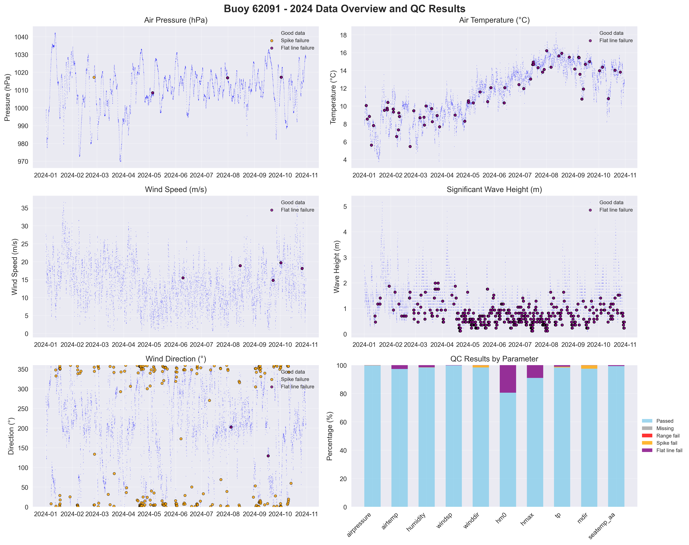

# Buoy 62091 - 2024 Quality Control Report

**Generated:** 2025-08-19 23:48:23

## Data Overview

- **Station ID:** 62091
- **Year:** 2024
- **Total Records:** 14,468
- **Time Range:** 2024-01-01 00:00:00 to 2024-10-30 23:00:00
- **Duration:** 303 days
- **Sensors/Loggers:** 4 active
  - 12105_CR6: 5,944 records (41.1%)
  - 7577_CR6: 5,943 records (41.1%)
  - 347_Wavesense: 1,292 records (8.9%)
  - 8704_CR6: 1,289 records (8.9%)

## Quality Control Results

### Record-Level QC Status

- **QC complete:** 11,301 records (78.1%)
- **No QC performed:** 3,167 records (21.9%)

### Parameter-Level QC Results

| Parameter | Total | Missing | Range Fail | Spike Fail | Flat Line Fail | Passed | Pass Rate |
|-----------|--------|---------|------------|------------|----------------|--------|-----------|
| airpressure | 14,468 | 0 | 0 | 1 | 17 | 14,450 | 99.9% |
| airtemp | 14,468 | 0 | 0 | 0 | 392 | 14,076 | 97.3% |
| humidity | 14,468 | 0 | 0 | 3 | 220 | 14,245 | 98.5% |
| windsp | 14,468 | 0 | 0 | 0 | 30 | 14,438 | 99.8% |
| winddir | 14,468 | 0 | 0 | 225 | 12 | 14,231 | 98.4% |
| hm0 | 14,468 | 0 | 0 | 0 | 2,806 | 11,662 | 80.6% |
| hmax | 14,468 | 0 | 0 | 0 | 1,294 | 13,174 | 91.1% |
| tp | 14,468 | 0 | 0 | 74 | 155 | 14,239 | 98.4% |
| mdir | 14,468 | 0 | 0 | 352 | 6 | 14,110 | 97.5% |
| seatemp_aa | 14,468 | 0 | 0 | 0 | 82 | 14,386 | 99.4% |

### Issues Identified

- airpressure: 1 spike values (>10.0 change)
- airpressure: 17 flat line values (5+ consecutive identical)
- airtemp: 392 flat line values (5+ consecutive identical)
- humidity: 3 spike values (>20.0 change)
- humidity: 220 flat line values (5+ consecutive identical)
- windsp: 30 flat line values (5+ consecutive identical)
- winddir: 225 spike values (>180.0 change)
- winddir: 12 flat line values (5+ consecutive identical)
- hm0: 2806 flat line values (5+ consecutive identical)
- hmax: 1294 flat line values (5+ consecutive identical)
- tp: 74 spike values (>10.0 change)
- tp: 155 flat line values (5+ consecutive identical)
- mdir: 352 spike values (>180.0 change)
- mdir: 6 flat line values (5+ consecutive identical)
- seatemp_aa: 82 flat line values (5+ consecutive identical)

## QC Limits Applied

Station-specific QC limits used for this analysis:

| Parameter | Min Value | Max Value | Spike Threshold | Notes |
|-----------|-----------|-----------|-----------------|-------|
| airpressure | 950.0 | 1050.0 | 10.0 | Default |
| airtemp | -20.0 | 40.0 | 5.0 | Default |
| humidity | 0.0 | 100.0 | 20.0 | Default |
| windsp | 0.0 | 60.0 | 20.0 | Station-specific |
| winddir | 0.0 | 360.0 | 180.0 | Default |
| hm0 | 0.0 | 18.0 | 4.0 | Station-specific |
| hmax | 0.0 | 30.0 | 6.0 | Station-specific |
| tp | 1.0 | 25.0 | 10.0 | Default |
| mdir | 0.0 | 360.0 | 180.0 | Default |
| seatemp_aa | 4.0 | 18.0 | 2.0 | Station-specific |

## Data Visualization

### QC Failure Color Coding

The visualization uses different colors to distinguish QC failure types:

- **Blue dots**: Good data (passed all QC tests)
- **Red dots**: Range failures (values outside physical limits)
- **Orange dots**: Spike failures (unrealistic sudden changes)
- **Purple dots**: Flat line failures (sensor stuck/malfunctioning)

The bottom-right panel shows a stacked bar chart with the percentage breakdown of each QC result type per parameter.

## Recommendations

### Manual QC Actions Needed

1. **Review flagged extreme values** - validate against weather events
2. **Investigate sensor failures** - replace/repair faulty sensors
3. **Cross-validate between loggers** - compare duplicate measurements
4. **Apply sensor hierarchy** - prioritize Wavesense for hm0, Datawell for hmax
5. **Transfer to production** - move QC'd data to irish_buoys_fugro table

### Next Steps

1. Execute parameter-level QC SQL commands from readme.md
2. Perform individual value corrections for flagged data
3. Complete record-level QC marking
4. Transfer approved data to production table
