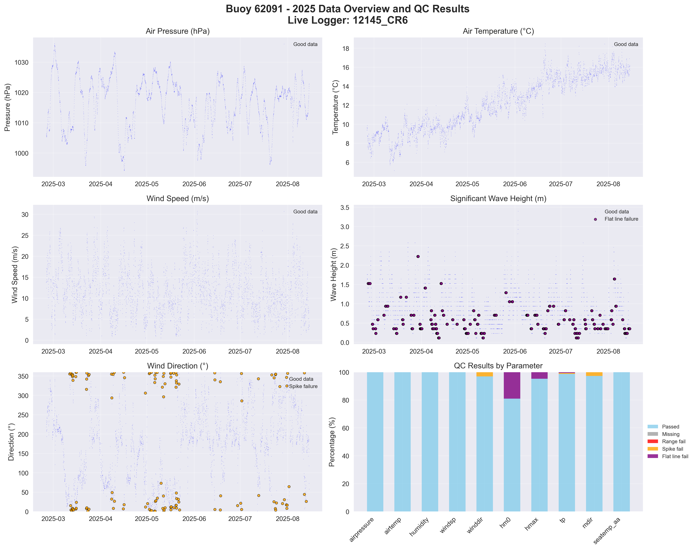

# Buoy 62091 - 2025 Quality Control Report

**Generated:** 2025-08-19 23:48:28

## Data Overview

- **Station ID:** 62091
- **Year:** 2025
- **Total Records:** 10,132
- **Time Range:** 2025-01-01 00:00:00 to 2025-08-14 23:00:00
- **Duration:** 225 days
- **Sensors/Loggers:** 4 active
  - 22221_CR6: 4,118 records (40.6%)
  - 12145_CR6: 4,118 records (40.6%)
  - 12105_CR6: 954 records (9.4%)
  - 7577_CR6: 942 records (9.3%)

## Quality Control Results

### Record-Level QC Status

- **QC complete:** 6,946 records (68.6%)
- **No QC performed:** 3,186 records (31.4%)

### Parameter-Level QC Results

| Parameter | Total | Missing | Range Fail | Spike Fail | Flat Line Fail | Passed | Pass Rate |
|-----------|--------|---------|------------|------------|----------------|--------|-----------|
| airpressure | 10,132 | 0 | 1 | 3 | 20 | 10,109 | 99.8% |
| airtemp | 10,132 | 0 | 0 | 2 | 274 | 9,856 | 97.3% |
| humidity | 10,132 | 0 | 0 | 4 | 84 | 10,044 | 99.1% |
| windsp | 10,132 | 0 | 0 | 0 | 30 | 10,102 | 99.7% |
| winddir | 10,132 | 0 | 0 | 137 | 30 | 9,966 | 98.4% |
| hm0 | 10,132 | 0 | 0 | 0 | 2,959 | 7,173 | 70.8% |
| hmax | 10,132 | 0 | 0 | 0 | 1,170 | 8,962 | 88.5% |
| tp | 10,132 | 0 | 1 | 101 | 81 | 9,950 | 98.2% |
| mdir | 10,132 | 0 | 0 | 261 | 0 | 9,871 | 97.4% |
| seatemp_aa | 10,132 | 0 | 1 | 6 | 18 | 10,108 | 99.8% |

### Issues Identified

- airpressure: 1 values outside range [950.0-1050.0]
- airpressure: 3 spike values (>10.0 change)
- airpressure: 20 flat line values (5+ consecutive identical)
- airtemp: 2 spike values (>5.0 change)
- airtemp: 274 flat line values (5+ consecutive identical)
- humidity: 4 spike values (>20.0 change)
- humidity: 84 flat line values (5+ consecutive identical)
- windsp: 30 flat line values (5+ consecutive identical)
- winddir: 137 spike values (>180.0 change)
- winddir: 30 flat line values (5+ consecutive identical)
- hm0: 2959 flat line values (5+ consecutive identical)
- hmax: 1170 flat line values (5+ consecutive identical)
- tp: 1 values outside range [1.0-25.0]
- tp: 101 spike values (>10.0 change)
- tp: 81 flat line values (5+ consecutive identical)
- mdir: 261 spike values (>180.0 change)
- seatemp_aa: 1 values outside range [4.0-18.0]
- seatemp_aa: 6 spike values (>2.0 change)
- seatemp_aa: 18 flat line values (5+ consecutive identical)

## QC Limits Applied

Station-specific QC limits used for this analysis:

| Parameter | Min Value | Max Value | Spike Threshold | Notes |
|-----------|-----------|-----------|-----------------|-------|
| airpressure | 950.0 | 1050.0 | 10.0 | Default |
| airtemp | -20.0 | 40.0 | 5.0 | Default |
| humidity | 0.0 | 100.0 | 20.0 | Default |
| windsp | 0.0 | 60.0 | 20.0 | Station-specific |
| winddir | 0.0 | 360.0 | 180.0 | Default |
| hm0 | 0.0 | 18.0 | 4.0 | Station-specific |
| hmax | 0.0 | 30.0 | 6.0 | Station-specific |
| tp | 1.0 | 25.0 | 10.0 | Default |
| mdir | 0.0 | 360.0 | 180.0 | Default |
| seatemp_aa | 4.0 | 18.0 | 2.0 | Station-specific |

## Data Visualization

### QC Failure Color Coding

The visualization uses different colors to distinguish QC failure types:

- **Blue dots**: Good data (passed all QC tests)
- **Red dots**: Range failures (values outside physical limits)
- **Orange dots**: Spike failures (unrealistic sudden changes)
- **Purple dots**: Flat line failures (sensor stuck/malfunctioning)

The bottom-right panel shows a stacked bar chart with the percentage breakdown of each QC result type per parameter.

## Recommendations

### Manual QC Actions Needed

1. **Review flagged extreme values** - validate against weather events
2. **Investigate sensor failures** - replace/repair faulty sensors
3. **Cross-validate between loggers** - compare duplicate measurements
4. **Apply sensor hierarchy** - prioritize Wavesense for hm0, Datawell for hmax
5. **Transfer to production** - move QC'd data to irish_buoys_fugro table

### Next Steps

1. Execute parameter-level QC SQL commands from readme.md
2. Perform individual value corrections for flagged data
3. Complete record-level QC marking
4. Transfer approved data to production table
