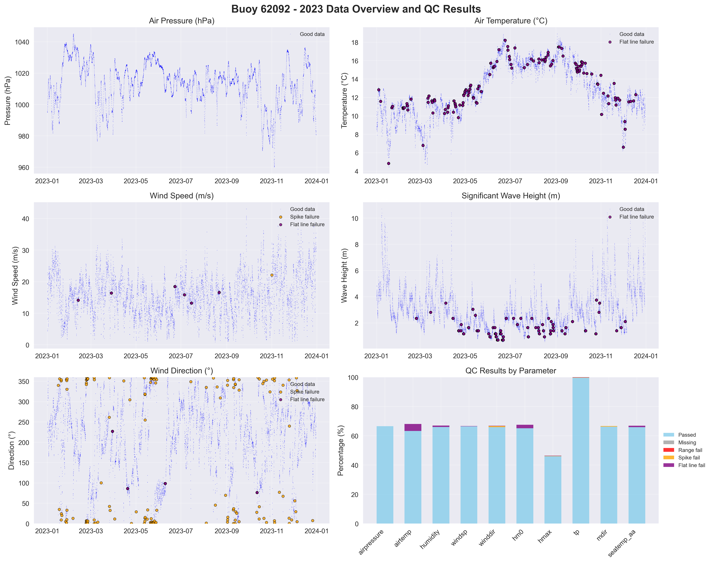

# Buoy 62092 - 2023 Quality Control Report

**Generated:** 2025-08-19 23:48:34

## Data Overview

- **Station ID:** 62092
- **Year:** 2023
- **Total Records:** 17,387
- **Time Range:** 2023-01-01 00:00:00 to 2023-12-30 23:00:00
- **Duration:** 363 days
- **Sensors/Loggers:** 2 active
  - 314_Wavesense: 8,735 records (50.2%)
  - 12146_CR6: 8,652 records (49.8%)

## Quality Control Results

### Record-Level QC Status

- **QC complete:** 16,615 records (95.6%)
- **No QC performed:** 772 records (4.4%)

### Parameter-Level QC Results

| Parameter | Total | Missing | Range Fail | Spike Fail | Flat Line Fail | Passed | Pass Rate |
|-----------|--------|---------|------------|------------|----------------|--------|-----------|
| airpressure | 17,387 | 0 | 0 | 0 | 0 | 11,580 | 66.6% |
| airtemp | 17,387 | 0 | 0 | 0 | 833 | 11,001 | 63.3% |
| humidity | 17,387 | 0 | 0 | 2 | 174 | 11,468 | 66.0% |
| windsp | 17,387 | 0 | 0 | 1 | 36 | 11,561 | 66.5% |
| winddir | 17,387 | 0 | 0 | 145 | 24 | 11,453 | 65.9% |
| hm0 | 17,387 | 0 | 0 | 0 | 409 | 11,324 | 65.1% |
| hmax | 17,387 | 0 | 1 | 32 | 43 | 8,003 | 46.0% |
| tp | 17,387 | 0 | 0 | 28 | 40 | 17,319 | 99.6% |
| mdir | 17,387 | 0 | 0 | 67 | 5 | 11,523 | 66.3% |
| seatemp_aa | 17,387 | 0 | 0 | 0 | 180 | 11,455 | 65.9% |

### Issues Identified

- airtemp: 833 flat line values (5+ consecutive identical)
- humidity: 2 spike values (>20.0 change)
- humidity: 174 flat line values (5+ consecutive identical)
- windsp: 1 spike values (>15.0 change)
- windsp: 36 flat line values (5+ consecutive identical)
- winddir: 145 spike values (>180.0 change)
- winddir: 24 flat line values (5+ consecutive identical)
- hm0: 409 flat line values (5+ consecutive identical)
- hmax: 1 values outside range [0.0-20.0]
- hmax: 32 spike values (>4.0 change)
- hmax: 43 flat line values (5+ consecutive identical)
- tp: 28 spike values (>10.0 change)
- tp: 40 flat line values (5+ consecutive identical)
- mdir: 67 spike values (>180.0 change)
- mdir: 5 flat line values (5+ consecutive identical)
- seatemp_aa: 180 flat line values (5+ consecutive identical)

## QC Limits Applied

Station-specific QC limits used for this analysis:

| Parameter | Min Value | Max Value | Spike Threshold | Notes |
|-----------|-----------|-----------|-----------------|-------|
| airpressure | 950.0 | 1050.0 | 10.0 | Default |
| airtemp | -20.0 | 40.0 | 5.0 | Default |
| humidity | 0.0 | 100.0 | 20.0 | Default |
| windsp | 0.0 | 50.0 | 15.0 | Default |
| winddir | 0.0 | 360.0 | 180.0 | Default |
| hm0 | 0.0 | 12.0 | 2.5 | Station-specific |
| hmax | 0.0 | 20.0 | 4.0 | Station-specific |
| tp | 1.0 | 25.0 | 10.0 | Default |
| mdir | 0.0 | 360.0 | 180.0 | Default |
| seatemp_aa | 6.0 | 20.0 | 2.5 | Station-specific |

## Data Visualization

### QC Failure Color Coding

The visualization uses different colors to distinguish QC failure types:

- **Blue dots**: Good data (passed all QC tests)
- **Red dots**: Range failures (values outside physical limits)
- **Orange dots**: Spike failures (unrealistic sudden changes)
- **Purple dots**: Flat line failures (sensor stuck/malfunctioning)

The bottom-right panel shows a stacked bar chart with the percentage breakdown of each QC result type per parameter.

## Recommendations

### Manual QC Actions Needed

1. **Review flagged extreme values** - validate against weather events
2. **Investigate sensor failures** - replace/repair faulty sensors
3. **Cross-validate between loggers** - compare duplicate measurements
4. **Apply sensor hierarchy** - prioritize Wavesense for hm0, Datawell for hmax
5. **Transfer to production** - move QC'd data to irish_buoys_fugro table

### Next Steps

1. Execute parameter-level QC SQL commands from readme.md
2. Perform individual value corrections for flagged data
3. Complete record-level QC marking
4. Transfer approved data to production table
