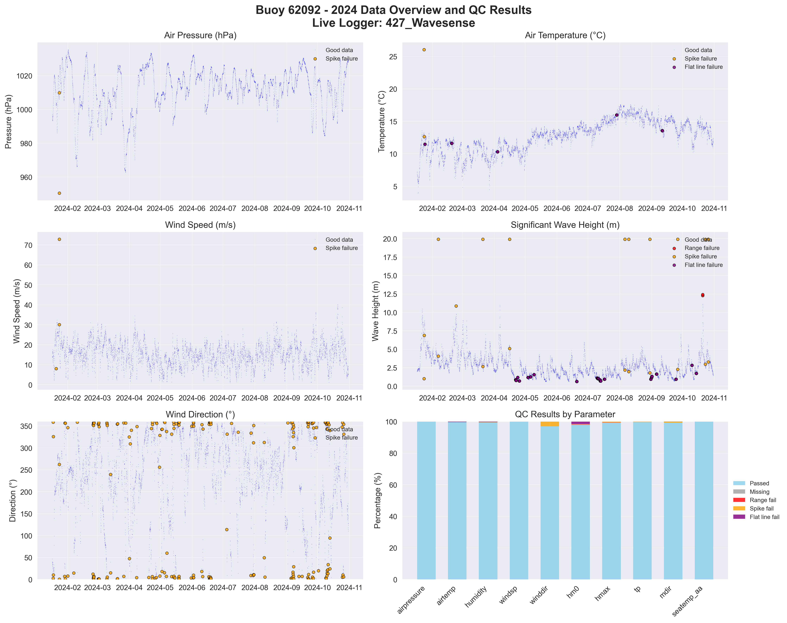

# Buoy 62092 - 2024 Quality Control Report

**Generated:** 2025-08-19 23:48:40

## Data Overview

- **Station ID:** 62092
- **Year:** 2024
- **Total Records:** 14,561
- **Time Range:** 2024-01-01 00:00:00 to 2024-10-30 23:00:00
- **Duration:** 303 days
- **Sensors/Loggers:** 4 active
  - 12147_CR6: 6,910 records (47.5%)
  - 427_Wavesense: 6,906 records (47.4%)
  - 314_Wavesense: 374 records (2.6%)
  - 12146_CR6: 371 records (2.5%)

## Quality Control Results

### Record-Level QC Status

- **QC complete:** 13,580 records (93.3%)
- **No QC performed:** 981 records (6.7%)

### Parameter-Level QC Results

| Parameter | Total | Missing | Range Fail | Spike Fail | Flat Line Fail | Passed | Pass Rate |
|-----------|--------|---------|------------|------------|----------------|--------|-----------|
| airpressure | 14,561 | 0 | 0 | 2 | 0 | 14,559 | 100.0% |
| airtemp | 14,561 | 0 | 0 | 2 | 671 | 13,888 | 95.4% |
| humidity | 14,561 | 0 | 0 | 4 | 148 | 14,410 | 99.0% |
| windsp | 14,561 | 0 | 1 | 3 | 44 | 14,514 | 99.7% |
| winddir | 14,561 | 0 | 0 | 204 | 24 | 14,333 | 98.4% |
| hm0 | 14,561 | 0 | 12 | 21 | 261 | 14,276 | 98.0% |
| hmax | 14,561 | 0 | 10 | 60 | 0 | 14,501 | 99.6% |
| tp | 14,561 | 0 | 0 | 21 | 27 | 14,513 | 99.7% |
| mdir | 14,561 | 0 | 0 | 77 | 25 | 14,459 | 99.3% |
| seatemp_aa | 14,561 | 0 | 1 | 2 | 84 | 14,475 | 99.4% |

### Issues Identified

- airpressure: 2 spike values (>10.0 change)
- airtemp: 2 spike values (>5.0 change)
- airtemp: 671 flat line values (5+ consecutive identical)
- humidity: 4 spike values (>20.0 change)
- humidity: 148 flat line values (5+ consecutive identical)
- windsp: 1 values outside range [0.0-50.0]
- windsp: 3 spike values (>15.0 change)
- windsp: 44 flat line values (5+ consecutive identical)
- winddir: 204 spike values (>180.0 change)
- winddir: 24 flat line values (5+ consecutive identical)
- hm0: 12 values outside range [0.0-12.0]
- hm0: 21 spike values (>2.5 change)
- hm0: 261 flat line values (5+ consecutive identical)
- hmax: 10 values outside range [0.0-20.0]
- hmax: 60 spike values (>4.0 change)
- tp: 21 spike values (>10.0 change)
- tp: 27 flat line values (5+ consecutive identical)
- mdir: 77 spike values (>180.0 change)
- mdir: 25 flat line values (5+ consecutive identical)
- seatemp_aa: 1 values outside range [6.0-20.0]
- seatemp_aa: 2 spike values (>2.5 change)
- seatemp_aa: 84 flat line values (5+ consecutive identical)

## QC Limits Applied

Station-specific QC limits used for this analysis:

| Parameter | Min Value | Max Value | Spike Threshold | Notes |
|-----------|-----------|-----------|-----------------|-------|
| airpressure | 950.0 | 1050.0 | 10.0 | Default |
| airtemp | -20.0 | 40.0 | 5.0 | Default |
| humidity | 0.0 | 100.0 | 20.0 | Default |
| windsp | 0.0 | 50.0 | 15.0 | Default |
| winddir | 0.0 | 360.0 | 180.0 | Default |
| hm0 | 0.0 | 12.0 | 2.5 | Station-specific |
| hmax | 0.0 | 20.0 | 4.0 | Station-specific |
| tp | 1.0 | 25.0 | 10.0 | Default |
| mdir | 0.0 | 360.0 | 180.0 | Default |
| seatemp_aa | 6.0 | 20.0 | 2.5 | Station-specific |

## Data Visualization

### QC Failure Color Coding

The visualization uses different colors to distinguish QC failure types:

- **Blue dots**: Good data (passed all QC tests)
- **Red dots**: Range failures (values outside physical limits)
- **Orange dots**: Spike failures (unrealistic sudden changes)
- **Purple dots**: Flat line failures (sensor stuck/malfunctioning)

The bottom-right panel shows a stacked bar chart with the percentage breakdown of each QC result type per parameter.

## Recommendations

### Manual QC Actions Needed

1. **Review flagged extreme values** - validate against weather events
2. **Investigate sensor failures** - replace/repair faulty sensors
3. **Cross-validate between loggers** - compare duplicate measurements
4. **Apply sensor hierarchy** - prioritize Wavesense for hm0, Datawell for hmax
5. **Transfer to production** - move QC'd data to irish_buoys_fugro table

### Next Steps

1. Execute parameter-level QC SQL commands from readme.md
2. Perform individual value corrections for flagged data
3. Complete record-level QC marking
4. Transfer approved data to production table
