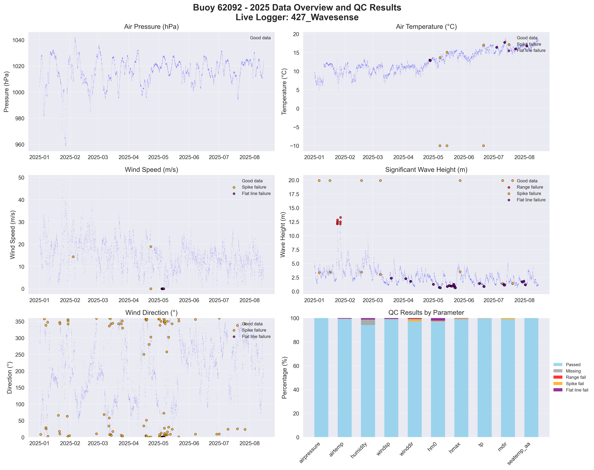

# Buoy 62092 - 2025 Quality Control Report

**Generated:** 2025-08-19 23:48:46

## Data Overview

- **Station ID:** 62092
- **Year:** 2025
- **Total Records:** 10,847
- **Time Range:** 2025-01-01 00:00:00 to 2025-08-14 23:00:00
- **Duration:** 225 days
- **Sensors/Loggers:** 2 active
  - 12147_CR6: 5,424 records (50.0%)
  - 427_Wavesense: 5,423 records (50.0%)

## Quality Control Results

### Record-Level QC Status

- **QC complete:** 9,675 records (89.2%)
- **No QC performed:** 1,172 records (10.8%)

### Parameter-Level QC Results

| Parameter | Total | Missing | Range Fail | Spike Fail | Flat Line Fail | Passed | Pass Rate |
|-----------|--------|---------|------------|------------|----------------|--------|-----------|
| airpressure | 10,847 | 0 | 0 | 0 | 12 | 10,835 | 99.9% |
| airtemp | 10,847 | 0 | 0 | 6 | 667 | 10,175 | 93.8% |
| humidity | 10,847 | 490 | 0 | 3 | 200 | 10,155 | 93.6% |
| windsp | 10,847 | 0 | 0 | 3 | 124 | 10,720 | 98.8% |
| winddir | 10,847 | 0 | 0 | 99 | 106 | 10,642 | 98.1% |
| hm0 | 10,847 | 0 | 26 | 14 | 354 | 10,460 | 96.4% |
| hmax | 10,847 | 0 | 11 | 39 | 0 | 10,806 | 99.6% |
| tp | 10,847 | 0 | 0 | 12 | 54 | 10,781 | 99.4% |
| mdir | 10,847 | 0 | 0 | 71 | 0 | 10,776 | 99.3% |
| seatemp_aa | 10,847 | 0 | 0 | 0 | 110 | 10,737 | 99.0% |

### Issues Identified

- airpressure: 12 flat line values (5+ consecutive identical)
- airtemp: 6 spike values (>5.0 change)
- airtemp: 667 flat line values (5+ consecutive identical)
- humidity: 3 spike values (>20.0 change)
- humidity: 200 flat line values (5+ consecutive identical)
- windsp: 3 spike values (>15.0 change)
- windsp: 124 flat line values (5+ consecutive identical)
- winddir: 99 spike values (>180.0 change)
- winddir: 106 flat line values (5+ consecutive identical)
- hm0: 26 values outside range [0.0-12.0]
- hm0: 14 spike values (>2.5 change)
- hm0: 354 flat line values (5+ consecutive identical)
- hmax: 11 values outside range [0.0-20.0]
- hmax: 39 spike values (>4.0 change)
- tp: 12 spike values (>10.0 change)
- tp: 54 flat line values (5+ consecutive identical)
- mdir: 71 spike values (>180.0 change)
- seatemp_aa: 110 flat line values (5+ consecutive identical)

## QC Limits Applied

Station-specific QC limits used for this analysis:

| Parameter | Min Value | Max Value | Spike Threshold | Notes |
|-----------|-----------|-----------|-----------------|-------|
| airpressure | 950.0 | 1050.0 | 10.0 | Default |
| airtemp | -20.0 | 40.0 | 5.0 | Default |
| humidity | 0.0 | 100.0 | 20.0 | Default |
| windsp | 0.0 | 50.0 | 15.0 | Default |
| winddir | 0.0 | 360.0 | 180.0 | Default |
| hm0 | 0.0 | 12.0 | 2.5 | Station-specific |
| hmax | 0.0 | 20.0 | 4.0 | Station-specific |
| tp | 1.0 | 25.0 | 10.0 | Default |
| mdir | 0.0 | 360.0 | 180.0 | Default |
| seatemp_aa | 6.0 | 20.0 | 2.5 | Station-specific |

## Data Visualization

### QC Failure Color Coding

The visualization uses different colors to distinguish QC failure types:

- **Blue dots**: Good data (passed all QC tests)
- **Red dots**: Range failures (values outside physical limits)
- **Orange dots**: Spike failures (unrealistic sudden changes)
- **Purple dots**: Flat line failures (sensor stuck/malfunctioning)

The bottom-right panel shows a stacked bar chart with the percentage breakdown of each QC result type per parameter.

## Recommendations

### Manual QC Actions Needed

1. **Review flagged extreme values** - validate against weather events
2. **Investigate sensor failures** - replace/repair faulty sensors
3. **Cross-validate between loggers** - compare duplicate measurements
4. **Apply sensor hierarchy** - prioritize Wavesense for hm0, Datawell for hmax
5. **Transfer to production** - move QC'd data to irish_buoys_fugro table

### Next Steps

1. Execute parameter-level QC SQL commands from readme.md
2. Perform individual value corrections for flagged data
3. Complete record-level QC marking
4. Transfer approved data to production table
