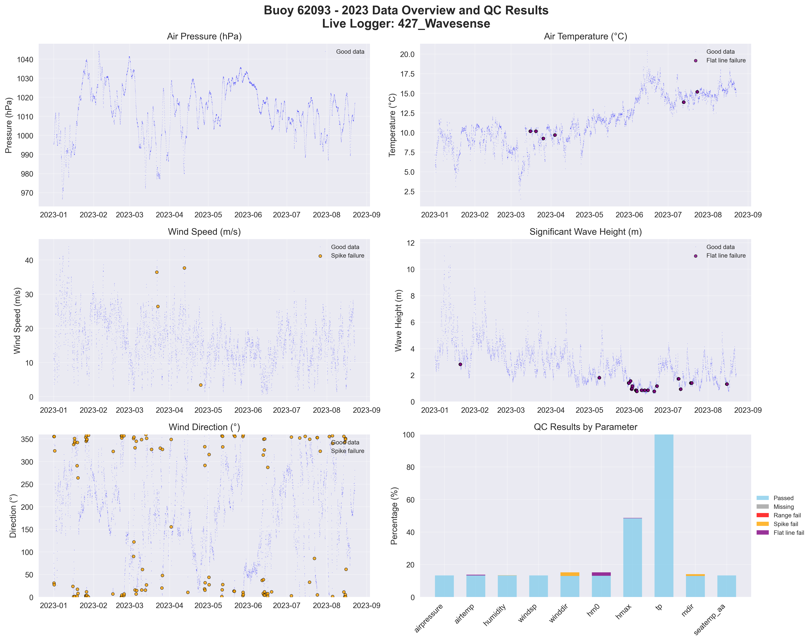

# Buoy 62093 - 2023 Quality Control Report

**Generated:** 2025-08-19 23:48:52

## Data Overview

- **Station ID:** 62093
- **Year:** 2023
- **Total Records:** 17,351
- **Time Range:** 2023-01-01 00:00:00 to 2023-12-30 23:00:00
- **Duration:** 363 days
- **Sensors/Loggers:** 4 active
  - 427_Wavesense: 5,607 records (32.3%)
  - 12147_CR6: 5,527 records (31.9%)
  - 12144_CR6: 3,109 records (17.9%)
  - 189_Wavesense: 3,108 records (17.9%)

## Quality Control Results

### Record-Level QC Status

- **QC complete:** 16,842 records (97.1%)
- **No QC performed:** 509 records (2.9%)

### Parameter-Level QC Results

| Parameter | Total | Missing | Range Fail | Spike Fail | Flat Line Fail | Passed | Pass Rate |
|-----------|--------|---------|------------|------------|----------------|--------|-----------|
| airpressure | 17,351 | 0 | 0 | 0 | 6 | 11,556 | 66.6% |
| airtemp | 17,351 | 0 | 0 | 0 | 606 | 11,160 | 64.3% |
| humidity | 17,351 | 0 | 0 | 13 | 135 | 11,456 | 66.0% |
| windsp | 17,351 | 0 | 0 | 5 | 24 | 11,537 | 66.5% |
| winddir | 17,351 | 0 | 0 | 195 | 14 | 11,417 | 65.8% |
| hm0 | 17,351 | 0 | 0 | 0 | 242 | 12,126 | 69.9% |
| hmax | 17,351 | 0 | 0 | 7 | 7 | 8,010 | 46.2% |
| tp | 17,351 | 0 | 0 | 21 | 60 | 17,270 | 99.5% |
| mdir | 17,351 | 0 | 0 | 539 | 0 | 11,155 | 64.3% |
| seatemp_aa | 17,351 | 0 | 0 | 0 | 211 | 11,421 | 65.8% |

### Issues Identified

- airpressure: 6 flat line values (5+ consecutive identical)
- airtemp: 606 flat line values (5+ consecutive identical)
- humidity: 13 spike values (>20.0 change)
- humidity: 135 flat line values (5+ consecutive identical)
- windsp: 5 spike values (>15.0 change)
- windsp: 24 flat line values (5+ consecutive identical)
- winddir: 195 spike values (>180.0 change)
- winddir: 14 flat line values (5+ consecutive identical)
- hm0: 242 flat line values (5+ consecutive identical)
- hmax: 7 spike values (>5.0 change)
- hmax: 7 flat line values (5+ consecutive identical)
- tp: 21 spike values (>10.0 change)
- tp: 60 flat line values (5+ consecutive identical)
- mdir: 539 spike values (>180.0 change)
- seatemp_aa: 211 flat line values (5+ consecutive identical)

## QC Limits Applied

Station-specific QC limits used for this analysis:

| Parameter | Min Value | Max Value | Spike Threshold | Notes |
|-----------|-----------|-----------|-----------------|-------|
| airpressure | 950.0 | 1050.0 | 10.0 | Default |
| airtemp | -20.0 | 40.0 | 5.0 | Default |
| humidity | 0.0 | 100.0 | 20.0 | Default |
| windsp | 0.0 | 50.0 | 15.0 | Default |
| winddir | 0.0 | 360.0 | 180.0 | Default |
| hm0 | 0.0 | 15.0 | 3.5 | Station-specific |
| hmax | 0.0 | 25.0 | 5.0 | Station-specific |
| tp | 1.0 | 25.0 | 10.0 | Default |
| mdir | 0.0 | 360.0 | 180.0 | Default |
| seatemp_aa | 5.0 | 19.0 | 2.5 | Station-specific |

## Data Visualization

### QC Failure Color Coding

The visualization uses different colors to distinguish QC failure types:

- **Blue dots**: Good data (passed all QC tests)
- **Red dots**: Range failures (values outside physical limits)
- **Orange dots**: Spike failures (unrealistic sudden changes)
- **Purple dots**: Flat line failures (sensor stuck/malfunctioning)

The bottom-right panel shows a stacked bar chart with the percentage breakdown of each QC result type per parameter.

## Recommendations

### Manual QC Actions Needed

1. **Review flagged extreme values** - validate against weather events
2. **Investigate sensor failures** - replace/repair faulty sensors
3. **Cross-validate between loggers** - compare duplicate measurements
4. **Apply sensor hierarchy** - prioritize Wavesense for hm0, Datawell for hmax
5. **Transfer to production** - move QC'd data to irish_buoys_fugro table

### Next Steps

1. Execute parameter-level QC SQL commands from readme.md
2. Perform individual value corrections for flagged data
3. Complete record-level QC marking
4. Transfer approved data to production table
