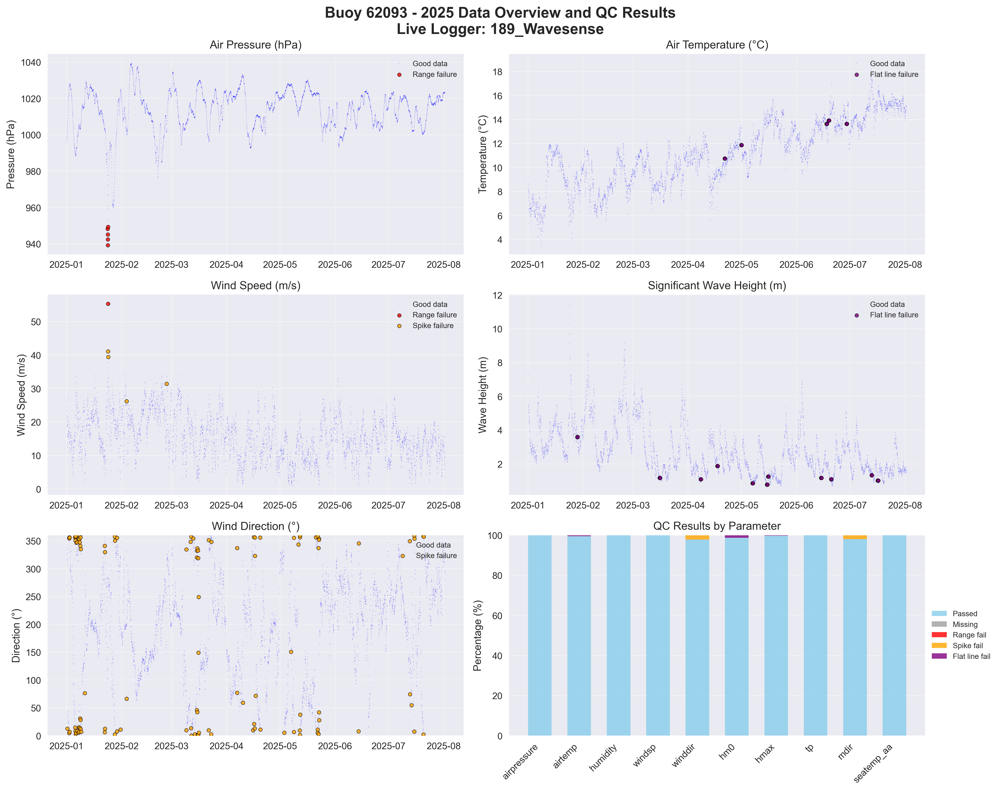

# Buoy 62093 - 2025 Quality Control Report

**Generated:** 2025-08-19 23:49:03

## Data Overview

- **Station ID:** 62093
- **Year:** 2025
- **Total Records:** 10,671
- **Time Range:** 2025-01-01 00:00:00 to 2025-08-14 23:00:00
- **Duration:** 225 days
- **Sensors/Loggers:** 4 active
  - 12144_CR6: 5,104 records (47.8%)
  - 189_Wavesense: 5,103 records (47.8%)
  - 12146_CR6: 232 records (2.2%)
  - 13443_CR6: 232 records (2.2%)

## Quality Control Results

### Record-Level QC Status

- **QC complete:** 9,952 records (93.3%)
- **No QC performed:** 719 records (6.7%)

### Parameter-Level QC Results

| Parameter | Total | Missing | Range Fail | Spike Fail | Flat Line Fail | Passed | Pass Rate |
|-----------|--------|---------|------------|------------|----------------|--------|-----------|
| airpressure | 10,671 | 0 | 10 | 0 | 6 | 10,655 | 99.9% |
| airtemp | 10,671 | 0 | 0 | 0 | 391 | 10,280 | 96.3% |
| humidity | 10,671 | 0 | 0 | 4 | 29 | 10,638 | 99.7% |
| windsp | 10,671 | 0 | 2 | 5 | 18 | 10,646 | 99.8% |
| winddir | 10,671 | 0 | 0 | 121 | 30 | 10,520 | 98.6% |
| hm0 | 10,671 | 0 | 0 | 1 | 294 | 10,376 | 97.2% |
| hmax | 10,671 | 0 | 0 | 3 | 19 | 10,649 | 99.8% |
| tp | 10,671 | 0 | 0 | 6 | 21 | 10,644 | 99.7% |
| mdir | 10,671 | 0 | 0 | 282 | 0 | 10,389 | 97.4% |
| seatemp_aa | 10,671 | 0 | 0 | 0 | 44 | 10,627 | 99.6% |

### Issues Identified

- airpressure: 10 values outside range [950.0-1050.0]
- airpressure: 6 flat line values (5+ consecutive identical)
- airtemp: 391 flat line values (5+ consecutive identical)
- humidity: 4 spike values (>20.0 change)
- humidity: 29 flat line values (5+ consecutive identical)
- windsp: 2 values outside range [0.0-50.0]
- windsp: 5 spike values (>15.0 change)
- windsp: 18 flat line values (5+ consecutive identical)
- winddir: 121 spike values (>180.0 change)
- winddir: 30 flat line values (5+ consecutive identical)
- hm0: 1 spike values (>3.5 change)
- hm0: 294 flat line values (5+ consecutive identical)
- hmax: 3 spike values (>5.0 change)
- hmax: 19 flat line values (5+ consecutive identical)
- tp: 6 spike values (>10.0 change)
- tp: 21 flat line values (5+ consecutive identical)
- mdir: 282 spike values (>180.0 change)
- seatemp_aa: 44 flat line values (5+ consecutive identical)

## QC Limits Applied

Station-specific QC limits used for this analysis:

| Parameter | Min Value | Max Value | Spike Threshold | Notes |
|-----------|-----------|-----------|-----------------|-------|
| airpressure | 950.0 | 1050.0 | 10.0 | Default |
| airtemp | -20.0 | 40.0 | 5.0 | Default |
| humidity | 0.0 | 100.0 | 20.0 | Default |
| windsp | 0.0 | 50.0 | 15.0 | Default |
| winddir | 0.0 | 360.0 | 180.0 | Default |
| hm0 | 0.0 | 15.0 | 3.5 | Station-specific |
| hmax | 0.0 | 25.0 | 5.0 | Station-specific |
| tp | 1.0 | 25.0 | 10.0 | Default |
| mdir | 0.0 | 360.0 | 180.0 | Default |
| seatemp_aa | 5.0 | 19.0 | 2.5 | Station-specific |

## Data Visualization

### QC Failure Color Coding

The visualization uses different colors to distinguish QC failure types:

- **Blue dots**: Good data (passed all QC tests)
- **Red dots**: Range failures (values outside physical limits)
- **Orange dots**: Spike failures (unrealistic sudden changes)
- **Purple dots**: Flat line failures (sensor stuck/malfunctioning)

The bottom-right panel shows a stacked bar chart with the percentage breakdown of each QC result type per parameter.

## Recommendations

### Manual QC Actions Needed

1. **Review flagged extreme values** - validate against weather events
2. **Investigate sensor failures** - replace/repair faulty sensors
3. **Cross-validate between loggers** - compare duplicate measurements
4. **Apply sensor hierarchy** - prioritize Wavesense for hm0, Datawell for hmax
5. **Transfer to production** - move QC'd data to irish_buoys_fugro table

### Next Steps

1. Execute parameter-level QC SQL commands from readme.md
2. Perform individual value corrections for flagged data
3. Complete record-level QC marking
4. Transfer approved data to production table
