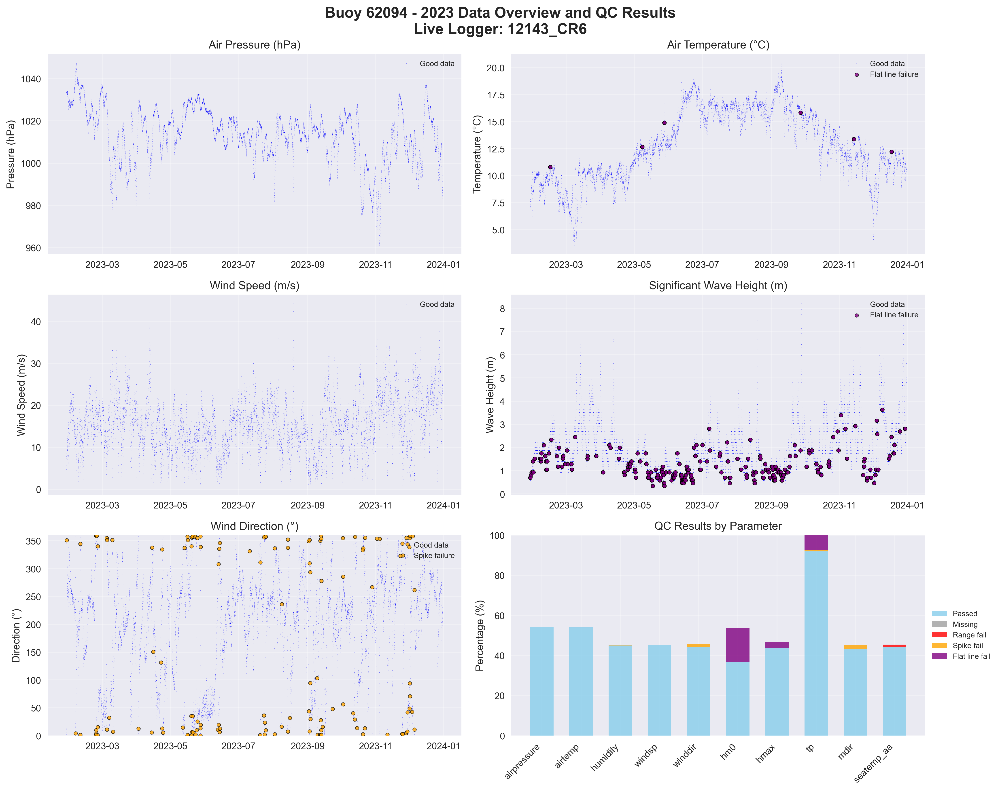

# Buoy 62094 - 2023 Quality Control Report

**Generated:** 2025-08-19 23:49:09

## Data Overview

- **Station ID:** 62094
- **Year:** 2023
- **Total Records:** 17,383
- **Time Range:** 2023-01-01 00:00:00 to 2023-12-30 23:00:00
- **Duration:** 363 days
- **Sensors/Loggers:** 4 active
  - 12143_CR6: 8,094 records (46.6%)
  - 12142_CR6: 8,011 records (46.1%)
  - 12144_CR6: 639 records (3.7%)
  - 189_Wavesense: 639 records (3.7%)

## Quality Control Results

### Record-Level QC Status

- **QC complete:** 15,567 records (89.6%)
- **No QC performed:** 1,816 records (10.4%)

### Parameter-Level QC Results

| Parameter | Total | Missing | Range Fail | Spike Fail | Flat Line Fail | Passed | Pass Rate |
|-----------|--------|---------|------------|------------|----------------|--------|-----------|
| airpressure | 17,383 | 0 | 0 | 0 | 6 | 11,575 | 66.6% |
| airtemp | 17,383 | 0 | 0 | 0 | 791 | 11,024 | 63.4% |
| humidity | 17,383 | 0 | 0 | 3 | 108 | 11,501 | 66.2% |
| windsp | 17,383 | 0 | 0 | 0 | 42 | 11,551 | 66.4% |
| winddir | 17,383 | 0 | 0 | 153 | 24 | 11,456 | 65.9% |
| hm0 | 17,383 | 0 | 0 | 0 | 2,323 | 10,068 | 57.9% |
| hmax | 17,383 | 0 | 0 | 0 | 998 | 8,263 | 47.5% |
| tp | 17,383 | 0 | 0 | 231 | 140 | 17,012 | 97.9% |
| mdir | 17,383 | 0 | 0 | 369 | 23 | 11,237 | 64.6% |
| seatemp_aa | 17,383 | 0 | 168 | 0 | 270 | 11,323 | 65.1% |

### Issues Identified

- airpressure: 6 flat line values (5+ consecutive identical)
- airtemp: 791 flat line values (5+ consecutive identical)
- humidity: 3 spike values (>20.0 change)
- humidity: 108 flat line values (5+ consecutive identical)
- windsp: 42 flat line values (5+ consecutive identical)
- winddir: 153 spike values (>180.0 change)
- winddir: 24 flat line values (5+ consecutive identical)
- hm0: 2323 flat line values (5+ consecutive identical)
- hmax: 998 flat line values (5+ consecutive identical)
- tp: 231 spike values (>10.0 change)
- tp: 140 flat line values (5+ consecutive identical)
- mdir: 369 spike values (>180.0 change)
- mdir: 23 flat line values (5+ consecutive identical)
- seatemp_aa: 168 values outside range [4.5-18.5]
- seatemp_aa: 270 flat line values (5+ consecutive identical)

## QC Limits Applied

Station-specific QC limits used for this analysis:

| Parameter | Min Value | Max Value | Spike Threshold | Notes |
|-----------|-----------|-----------|-----------------|-------|
| airpressure | 950.0 | 1050.0 | 10.0 | Default |
| airtemp | -20.0 | 40.0 | 5.0 | Default |
| humidity | 0.0 | 100.0 | 20.0 | Default |
| windsp | 0.0 | 55.0 | 18.0 | Station-specific |
| winddir | 0.0 | 360.0 | 180.0 | Default |
| hm0 | 0.0 | 16.0 | 3.5 | Station-specific |
| hmax | 0.0 | 26.0 | 5.5 | Station-specific |
| tp | 1.0 | 25.0 | 10.0 | Default |
| mdir | 0.0 | 360.0 | 180.0 | Default |
| seatemp_aa | 4.5 | 18.5 | 2.5 | Station-specific |

## Data Visualization

### QC Failure Color Coding

The visualization uses different colors to distinguish QC failure types:

- **Blue dots**: Good data (passed all QC tests)
- **Red dots**: Range failures (values outside physical limits)
- **Orange dots**: Spike failures (unrealistic sudden changes)
- **Purple dots**: Flat line failures (sensor stuck/malfunctioning)

The bottom-right panel shows a stacked bar chart with the percentage breakdown of each QC result type per parameter.

## Recommendations

### Manual QC Actions Needed

1. **Review flagged extreme values** - validate against weather events
2. **Investigate sensor failures** - replace/repair faulty sensors
3. **Cross-validate between loggers** - compare duplicate measurements
4. **Apply sensor hierarchy** - prioritize Wavesense for hm0, Datawell for hmax
5. **Transfer to production** - move QC'd data to irish_buoys_fugro table

### Next Steps

1. Execute parameter-level QC SQL commands from readme.md
2. Perform individual value corrections for flagged data
3. Complete record-level QC marking
4. Transfer approved data to production table
