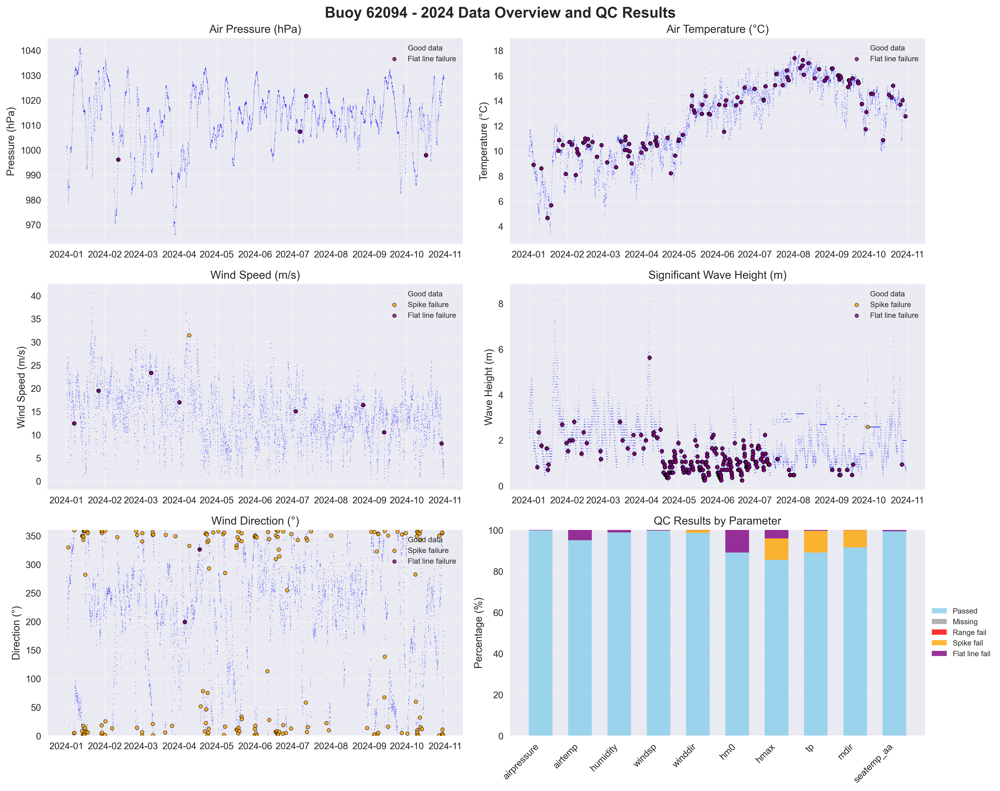

# Buoy 62094 - 2024 Quality Control Report

**Generated:** 2025-08-27 15:57:56

## Data Overview

- **Station ID:** 62094
- **Year:** 2024
- **Total Records:** 14,495
- **Time Range:** 2024-01-01 00:00:00 to 2024-10-30 23:00:00
- **Duration:** 303 days
- **Sensors/Loggers:** 4 active
  - 12143_CR6: 4,666 records (32.2%)
  - 12142_CR6: 4,662 records (32.2%)
  - 8704_CR6: 2,584 records (17.8%)
  - 347_Wavesense: 2,583 records (17.8%)

## Quality Control Results

### Record-Level QC Status

- **QC complete:** 12,213 records (84.3%)
- **No QC performed:** 2,282 records (15.7%)

### Parameter-Level QC Results

| Parameter | Total | Missing | Range Fail | Spike Fail | Flat Line Fail | Passed | Pass Rate |
|-----------|--------|---------|------------|------------|----------------|--------|-----------|
| airpressure | 14,495 | 0 | 0 | 0 | 24 | 14,471 | 99.8% |
| airtemp | 14,495 | 0 | 0 | 0 | 721 | 13,774 | 95.0% |
| humidity | 14,495 | 0 | 0 | 4 | 170 | 14,322 | 98.8% |
| windsp | 14,495 | 0 | 0 | 1 | 48 | 14,446 | 99.7% |
| winddir | 14,495 | 0 | 0 | 179 | 12 | 14,304 | 98.7% |
| hm0 | 14,495 | 0 | 0 | 1 | 1,584 | 12,910 | 89.1% |
| hmax | 14,495 | 0 | 0 | 1,512 | 593 | 12,390 | 85.5% |
| tp | 14,495 | 0 | 0 | 1,538 | 51 | 12,906 | 89.0% |
| mdir | 14,495 | 0 | 0 | 1,224 | 5 | 13,266 | 91.5% |
| seatemp_aa | 14,495 | 0 | 2 | 2 | 92 | 14,400 | 99.3% |

### Issues Identified

- airpressure: 24 flat line values (5+ consecutive identical)
- airtemp: 721 flat line values (5+ consecutive identical)
- humidity: 4 spike values (>20.0 change)
- humidity: 170 flat line values (5+ consecutive identical)
- windsp: 1 spike values (>18.0 change)
- windsp: 48 flat line values (5+ consecutive identical)
- winddir: 179 spike values (>180.0 change)
- winddir: 12 flat line values (5+ consecutive identical)
- hm0: 1 spike values (>3.5 change)
- hm0: 1584 flat line values (5+ consecutive identical)
- hmax: 1512 spike values (>5.5 change)
- hmax: 593 flat line values (5+ consecutive identical)
- tp: 1538 spike values (>10.0 change)
- tp: 51 flat line values (5+ consecutive identical)
- mdir: 1224 spike values (>180.0 change)
- mdir: 5 flat line values (5+ consecutive identical)
- seatemp_aa: 2 values outside range [4.5-18.5]
- seatemp_aa: 2 spike values (>2.5 change)
- seatemp_aa: 92 flat line values (5+ consecutive identical)

## QC Limits Applied

Station-specific QC limits used for this analysis:

| Parameter | Min Value | Max Value | Spike Threshold | Notes |
|-----------|-----------|-----------|-----------------|-------|
| airpressure | 950.0 | 1050.0 | 10.0 | Default |
| airtemp | -20.0 | 40.0 | 5.0 | Default |
| humidity | 0.0 | 100.0 | 20.0 | Default |
| windsp | 0.0 | 55.0 | 18.0 | Station-specific |
| winddir | 0.0 | 360.0 | 180.0 | Default |
| hm0 | 0.0 | 16.0 | 3.5 | Station-specific |
| hmax | 0.0 | 26.0 | 5.5 | Station-specific |
| tp | 1.0 | 25.0 | 10.0 | Default |
| mdir | 0.0 | 360.0 | 180.0 | Default |
| seatemp_aa | 4.5 | 18.5 | 2.5 | Station-specific |

## Data Visualization

### QC Failure Color Coding

The visualization uses different colors to distinguish QC failure types:

- **Blue dots**: Good data (passed all QC tests)
- **Red dots**: Range failures (values outside physical limits)
- **Orange dots**: Spike failures (unrealistic sudden changes)
- **Purple dots**: Flat line failures (sensor stuck/malfunctioning)

The bottom-right panel shows a stacked bar chart with the percentage breakdown of each QC result type per parameter.

## Recommendations

### Critical Issues

- **hmax**: High failure rate - investigate sensor calibration
- **tp**: High failure rate - investigate sensor calibration

### Manual QC Actions Needed

1. **Review flagged extreme values** - validate against weather events
2. **Investigate sensor failures** - replace/repair faulty sensors
3. **Cross-validate between loggers** - compare duplicate measurements
4. **Apply sensor hierarchy** - prioritize Wavesense for hm0, Datawell for hmax
5. **Transfer to production** - move QC'd data to irish_buoys_fugro table

### Next Steps

1. Execute parameter-level QC SQL commands from readme.md
2. Perform individual value corrections for flagged data
3. Complete record-level QC marking
4. Transfer approved data to production table
