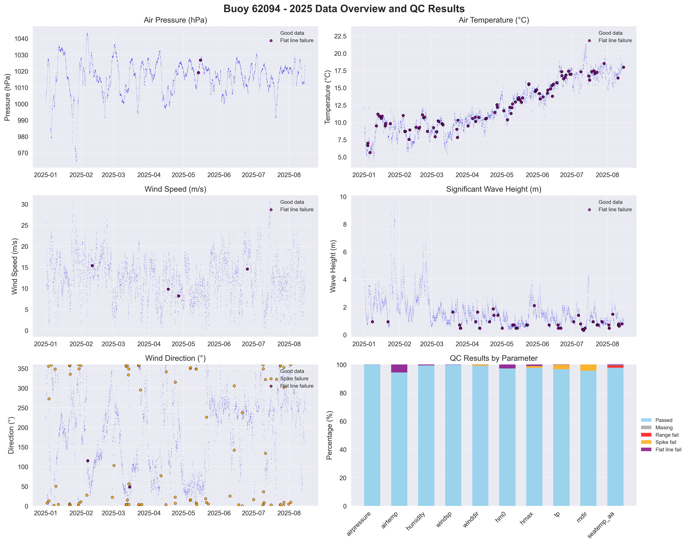

# Buoy 62094 - 2025 Quality Control Report

**Generated:** 2025-08-19 23:49:20

## Data Overview

- **Station ID:** 62094
- **Year:** 2025
- **Total Records:** 10,442
- **Time Range:** 2025-01-01 00:00:00 to 2025-08-14 23:00:00
- **Duration:** 225 days
- **Sensors/Loggers:** 2 active
  - 347_Wavesense: 5,423 records (51.9%)
  - 8704_CR6: 5,019 records (48.1%)

## Quality Control Results

### Record-Level QC Status

- **QC complete:** 9,539 records (91.4%)
- **No QC performed:** 903 records (8.6%)

### Parameter-Level QC Results

| Parameter | Total | Missing | Range Fail | Spike Fail | Flat Line Fail | Passed | Pass Rate |
|-----------|--------|---------|------------|------------|----------------|--------|-----------|
| airpressure | 10,442 | 0 | 0 | 0 | 12 | 10,430 | 99.9% |
| airtemp | 10,442 | 0 | 0 | 0 | 590 | 9,852 | 94.3% |
| humidity | 10,442 | 0 | 0 | 1 | 60 | 10,381 | 99.4% |
| windsp | 10,442 | 0 | 0 | 0 | 24 | 10,418 | 99.8% |
| winddir | 10,442 | 0 | 0 | 90 | 12 | 10,340 | 99.0% |
| hm0 | 10,442 | 0 | 0 | 0 | 288 | 10,154 | 97.2% |
| hmax | 10,442 | 0 | 0 | 137 | 105 | 10,200 | 97.7% |
| tp | 10,442 | 0 | 0 | 324 | 24 | 10,094 | 96.7% |
| mdir | 10,442 | 0 | 0 | 466 | 0 | 9,976 | 95.5% |
| seatemp_aa | 10,442 | 0 | 136 | 24 | 92 | 10,203 | 97.7% |

### Issues Identified

- airpressure: 12 flat line values (5+ consecutive identical)
- airtemp: 590 flat line values (5+ consecutive identical)
- humidity: 1 spike values (>20.0 change)
- humidity: 60 flat line values (5+ consecutive identical)
- windsp: 24 flat line values (5+ consecutive identical)
- winddir: 90 spike values (>180.0 change)
- winddir: 12 flat line values (5+ consecutive identical)
- hm0: 288 flat line values (5+ consecutive identical)
- hmax: 137 spike values (>5.5 change)
- hmax: 105 flat line values (5+ consecutive identical)
- tp: 324 spike values (>10.0 change)
- tp: 24 flat line values (5+ consecutive identical)
- mdir: 466 spike values (>180.0 change)
- seatemp_aa: 136 values outside range [4.5-18.5]
- seatemp_aa: 24 spike values (>2.5 change)
- seatemp_aa: 92 flat line values (5+ consecutive identical)

## QC Limits Applied

Station-specific QC limits used for this analysis:

| Parameter | Min Value | Max Value | Spike Threshold | Notes |
|-----------|-----------|-----------|-----------------|-------|
| airpressure | 950.0 | 1050.0 | 10.0 | Default |
| airtemp | -20.0 | 40.0 | 5.0 | Default |
| humidity | 0.0 | 100.0 | 20.0 | Default |
| windsp | 0.0 | 55.0 | 18.0 | Station-specific |
| winddir | 0.0 | 360.0 | 180.0 | Default |
| hm0 | 0.0 | 16.0 | 3.5 | Station-specific |
| hmax | 0.0 | 26.0 | 5.5 | Station-specific |
| tp | 1.0 | 25.0 | 10.0 | Default |
| mdir | 0.0 | 360.0 | 180.0 | Default |
| seatemp_aa | 4.5 | 18.5 | 2.5 | Station-specific |

## Data Visualization

### QC Failure Color Coding

The visualization uses different colors to distinguish QC failure types:

- **Blue dots**: Good data (passed all QC tests)
- **Red dots**: Range failures (values outside physical limits)
- **Orange dots**: Spike failures (unrealistic sudden changes)
- **Purple dots**: Flat line failures (sensor stuck/malfunctioning)

The bottom-right panel shows a stacked bar chart with the percentage breakdown of each QC result type per parameter.

## Recommendations

### Manual QC Actions Needed

1. **Review flagged extreme values** - validate against weather events
2. **Investigate sensor failures** - replace/repair faulty sensors
3. **Cross-validate between loggers** - compare duplicate measurements
4. **Apply sensor hierarchy** - prioritize Wavesense for hm0, Datawell for hmax
5. **Transfer to production** - move QC'd data to irish_buoys_fugro table

### Next Steps

1. Execute parameter-level QC SQL commands from readme.md
2. Perform individual value corrections for flagged data
3. Complete record-level QC marking
4. Transfer approved data to production table
