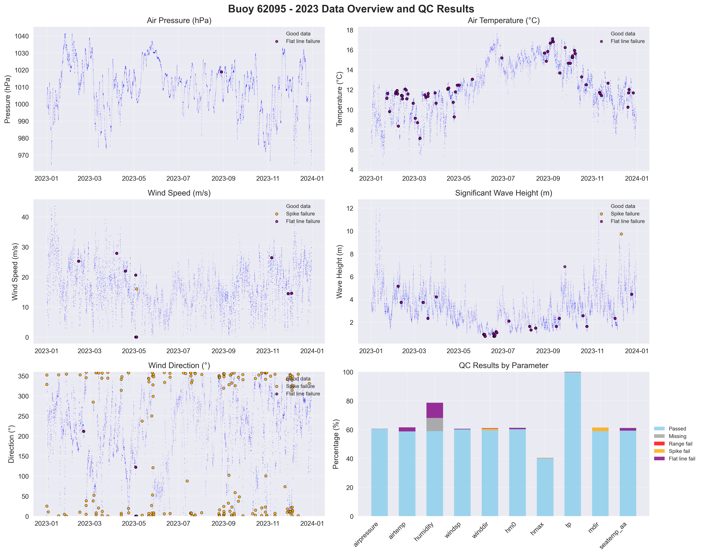

# Buoy 62095 - 2023 Quality Control Report

**Generated:** 2025-08-19 23:49:26

## Data Overview

- **Station ID:** 62095
- **Year:** 2023
- **Total Records:** 14,665
- **Time Range:** 2023-01-01 00:00:00 to 2023-12-30 23:00:00
- **Duration:** 363 days
- **Sensors/Loggers:** 4 active
  - 332_Wavesense: 5,632 records (38.4%)
  - 12145_CR6: 3,087 records (21.1%)
  - 341_Wavesense: 3,085 records (21.0%)
  - 7577_CR6: 2,861 records (19.5%)

## Quality Control Results

### Record-Level QC Status

- **QC complete:** 14,337 records (97.8%)
- **No QC performed:** 328 records (2.2%)

### Parameter-Level QC Results

| Parameter | Total | Missing | Range Fail | Spike Fail | Flat Line Fail | Passed | Pass Rate |
|-----------|--------|---------|------------|------------|----------------|--------|-----------|
| airpressure | 14,665 | 0 | 0 | 0 | 6 | 8,871 | 60.5% |
| airtemp | 14,665 | 0 | 0 | 0 | 412 | 8,608 | 58.7% |
| humidity | 14,665 | 1,339 | 0 | 6 | 1,549 | 8,640 | 58.9% |
| windsp | 14,665 | 0 | 0 | 2 | 70 | 8,812 | 60.1% |
| winddir | 14,665 | 0 | 0 | 177 | 40 | 8,725 | 59.5% |
| hm0 | 14,665 | 0 | 0 | 1 | 137 | 8,833 | 60.2% |
| hmax | 14,665 | 0 | 0 | 28 | 16 | 5,867 | 40.0% |
| tp | 14,665 | 0 | 0 | 8 | 26 | 14,631 | 99.8% |
| mdir | 14,665 | 0 | 0 | 361 | 0 | 8,651 | 59.0% |
| seatemp_aa | 14,665 | 0 | 0 | 0 | 267 | 8,692 | 59.3% |

### Issues Identified

- airpressure: 6 flat line values (5+ consecutive identical)
- airtemp: 412 flat line values (5+ consecutive identical)
- humidity: 6 spike values (>20.0 change)
- humidity: 1549 flat line values (5+ consecutive identical)
- windsp: 2 spike values (>15.0 change)
- windsp: 70 flat line values (5+ consecutive identical)
- winddir: 177 spike values (>180.0 change)
- winddir: 40 flat line values (5+ consecutive identical)
- hm0: 1 spike values (>3.0 change)
- hm0: 137 flat line values (5+ consecutive identical)
- hmax: 28 spike values (>4.5 change)
- hmax: 16 flat line values (5+ consecutive identical)
- tp: 8 spike values (>10.0 change)
- tp: 26 flat line values (5+ consecutive identical)
- mdir: 361 spike values (>180.0 change)
- seatemp_aa: 267 flat line values (5+ consecutive identical)

## QC Limits Applied

Station-specific QC limits used for this analysis:

| Parameter | Min Value | Max Value | Spike Threshold | Notes |
|-----------|-----------|-----------|-----------------|-------|
| airpressure | 950.0 | 1050.0 | 10.0 | Default |
| airtemp | -15.0 | 35.0 | 4.0 | Station-specific |
| humidity | 0.0 | 100.0 | 20.0 | Default |
| windsp | 0.0 | 50.0 | 15.0 | Default |
| winddir | 0.0 | 360.0 | 180.0 | Default |
| hm0 | 0.0 | 14.0 | 3.0 | Station-specific |
| hmax | 0.0 | 22.0 | 4.5 | Station-specific |
| tp | 1.0 | 25.0 | 10.0 | Default |
| mdir | 0.0 | 360.0 | 180.0 | Default |
| seatemp_aa | 6.0 | 19.0 | 2.0 | Station-specific |

## Data Visualization

### QC Failure Color Coding

The visualization uses different colors to distinguish QC failure types:

- **Blue dots**: Good data (passed all QC tests)
- **Red dots**: Range failures (values outside physical limits)
- **Orange dots**: Spike failures (unrealistic sudden changes)
- **Purple dots**: Flat line failures (sensor stuck/malfunctioning)

The bottom-right panel shows a stacked bar chart with the percentage breakdown of each QC result type per parameter.

## Recommendations

### Manual QC Actions Needed

1. **Review flagged extreme values** - validate against weather events
2. **Investigate sensor failures** - replace/repair faulty sensors
3. **Cross-validate between loggers** - compare duplicate measurements
4. **Apply sensor hierarchy** - prioritize Wavesense for hm0, Datawell for hmax
5. **Transfer to production** - move QC'd data to irish_buoys_fugro table

### Next Steps

1. Execute parameter-level QC SQL commands from readme.md
2. Perform individual value corrections for flagged data
3. Complete record-level QC marking
4. Transfer approved data to production table
