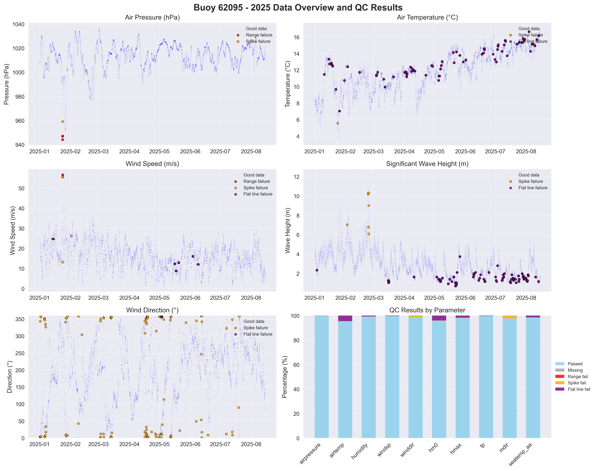

# Buoy 62095 - 2025 Quality Control Report

**Generated:** 2025-08-27 15:58:37

## Data Overview

- **Station ID:** 62095
- **Year:** 2025
- **Total Records:** 10,848
- **Time Range:** 2025-01-01 00:00:00 to 2025-08-14 23:00:00
- **Duration:** 225 days
- **Sensors/Loggers:** 4 active
  - 13443_CR6: 3,156 records (29.1%)
  - 12146_CR6: 3,156 records (29.1%)
  - 12142_CR6: 2,268 records (20.9%)
  - 12143_CR6: 2,268 records (20.9%)

## Quality Control Results

### Record-Level QC Status

- **QC complete:** 9,902 records (91.3%)
- **No QC performed:** 946 records (8.7%)

### Parameter-Level QC Results

| Parameter | Total | Missing | Range Fail | Spike Fail | Flat Line Fail | Passed | Pass Rate |
|-----------|--------|---------|------------|------------|----------------|--------|-----------|
| airpressure | 10,848 | 0 | 6 | 1 | 0 | 10,841 | 99.9% |
| airtemp | 10,848 | 0 | 0 | 1 | 490 | 10,357 | 95.5% |
| humidity | 10,848 | 0 | 0 | 9 | 80 | 10,759 | 99.2% |
| windsp | 10,848 | 0 | 4 | 3 | 36 | 10,806 | 99.6% |
| winddir | 10,848 | 0 | 0 | 114 | 6 | 10,728 | 98.9% |
| hm0 | 10,848 | 0 | 0 | 7 | 437 | 10,404 | 95.9% |
| hmax | 10,848 | 0 | 0 | 6 | 188 | 10,654 | 98.2% |
| tp | 10,848 | 0 | 0 | 1 | 25 | 10,822 | 99.8% |
| mdir | 10,848 | 0 | 0 | 244 | 0 | 10,604 | 97.8% |
| seatemp_aa | 10,848 | 0 | 0 | 0 | 164 | 10,684 | 98.5% |

### Issues Identified

- airpressure: 6 values outside range [950.0-1050.0]
- airpressure: 1 spike values (>10.0 change)
- airtemp: 1 spike values (>4.0 change)
- airtemp: 490 flat line values (5+ consecutive identical)
- humidity: 9 spike values (>20.0 change)
- humidity: 80 flat line values (5+ consecutive identical)
- windsp: 4 values outside range [0.0-50.0]
- windsp: 3 spike values (>15.0 change)
- windsp: 36 flat line values (5+ consecutive identical)
- winddir: 114 spike values (>180.0 change)
- winddir: 6 flat line values (5+ consecutive identical)
- hm0: 7 spike values (>3.0 change)
- hm0: 437 flat line values (5+ consecutive identical)
- hmax: 6 spike values (>4.5 change)
- hmax: 188 flat line values (5+ consecutive identical)
- tp: 1 spike values (>10.0 change)
- tp: 25 flat line values (5+ consecutive identical)
- mdir: 244 spike values (>180.0 change)
- seatemp_aa: 164 flat line values (5+ consecutive identical)

## QC Limits Applied

Station-specific QC limits used for this analysis:

| Parameter | Min Value | Max Value | Spike Threshold | Notes |
|-----------|-----------|-----------|-----------------|-------|
| airpressure | 950.0 | 1050.0 | 10.0 | Default |
| airtemp | -15.0 | 35.0 | 4.0 | Station-specific |
| humidity | 0.0 | 100.0 | 20.0 | Default |
| windsp | 0.0 | 50.0 | 15.0 | Default |
| winddir | 0.0 | 360.0 | 180.0 | Default |
| hm0 | 0.0 | 14.0 | 3.0 | Station-specific |
| hmax | 0.0 | 22.0 | 4.5 | Station-specific |
| tp | 1.0 | 25.0 | 10.0 | Default |
| mdir | 0.0 | 360.0 | 180.0 | Default |
| seatemp_aa | 6.0 | 19.0 | 2.0 | Station-specific |

## Data Visualization

### QC Failure Color Coding

The visualization uses different colors to distinguish QC failure types:

- **Blue dots**: Good data (passed all QC tests)
- **Red dots**: Range failures (values outside physical limits)
- **Orange dots**: Spike failures (unrealistic sudden changes)
- **Purple dots**: Flat line failures (sensor stuck/malfunctioning)

The bottom-right panel shows a stacked bar chart with the percentage breakdown of each QC result type per parameter.

## Recommendations

### Manual QC Actions Needed

1. **Review flagged extreme values** - validate against weather events
2. **Investigate sensor failures** - replace/repair faulty sensors
3. **Cross-validate between loggers** - compare duplicate measurements
4. **Apply sensor hierarchy** - prioritize Wavesense for hm0, Datawell for hmax
5. **Transfer to production** - move QC'd data to irish_buoys_fugro table

### Next Steps

1. Execute parameter-level QC SQL commands from readme.md
2. Perform individual value corrections for flagged data
3. Complete record-level QC marking
4. Transfer approved data to production table
