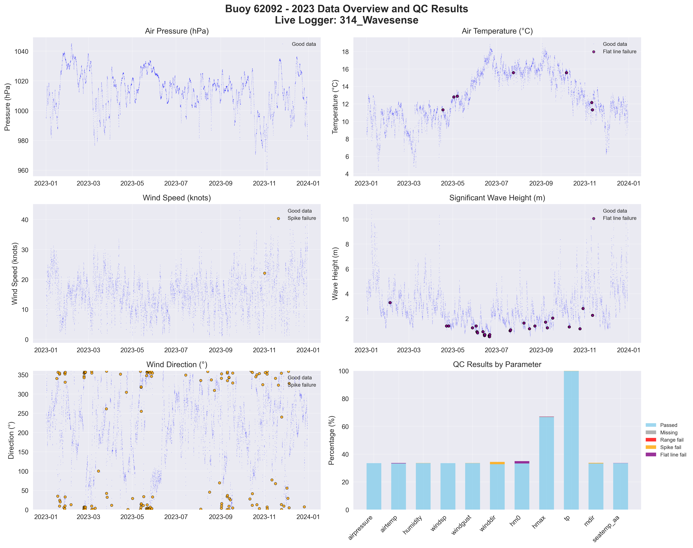

# Buoy 62092 - 2023 Quality Control Report

**Generated:** 2025-10-02 13:40:27

## Data Overview

- **Station ID:** 62092
- **Year:** 2023
- **Total Records:** 8,735
- **Time Range:** 2023-01-01 00:00:00 to 2023-12-30 23:00:00
- **Duration:** 363 days
- **Sensors/Loggers:** 1 active
  - 314_Wavesense: 8,735 records (100.0%)
- **Live Logger Used:** 314_Wavesense
  - Active Period: 2022-01-21 15:00 to 2024-01-16 13:00
  - Wave Data Available: No

## Quality Control Results

### Record-Level QC Status

- **QC complete:** 8,701 records (99.6%)
- **No QC performed:** 34 records (0.4%)

### Parameter-Level QC Results

| Parameter | Total | Missing | Range Fail | Spike Fail | Flat Line Fail | Passed | Pass Rate |
|-----------|--------|---------|------------|------------|----------------|--------|-----------|
| airpressure | 8,735 | 0 | 0 | 0 | 0 | 2,928 | 33.5% |
| airtemp | 8,735 | 0 | 0 | 0 | 37 | 2,901 | 33.2% |
| humidity | 8,735 | 0 | 0 | 2 | 5 | 2,928 | 33.5% |
| windsp | 8,735 | 0 | 0 | 1 | 0 | 2,927 | 33.5% |
| windgust | 8,735 | 0 | 0 | 1 | 0 | 2,928 | 33.5% |
| winddir | 8,735 | 0 | 0 | 145 | 0 | 2,860 | 32.7% |
| hm0 | 8,735 | 0 | 0 | 0 | 150 | 2,902 | 33.2% |
| hmax | 8,735 | 0 | 0 | 8 | 21 | 5,830 | 66.7% |
| tp | 8,735 | 0 | 0 | 4 | 5 | 8,726 | 99.9% |
| mdir | 8,735 | 0 | 0 | 35 | 5 | 2,905 | 33.3% |
| seatemp_aa | 8,735 | 0 | 0 | 0 | 5 | 2,928 | 33.5% |

### Issues Identified

- airtemp: 37 flat line values (5+ consecutive identical)
- humidity: 2 spike values (>20.0 change)
- humidity: 5 flat line values (5+ consecutive identical)
- windsp: 1 spike values (>15.0 change)
- windgust: 1 spike values (>20.0 change)
- winddir: 145 spike values (>180.0 change)
- hm0: 150 flat line values (5+ consecutive identical)
- hmax: 8 spike values (>4.0 change)
- hmax: 21 flat line values (5+ consecutive identical)
- tp: 4 spike values (>10.0 change)
- tp: 5 flat line values (5+ consecutive identical)
- mdir: 35 spike values (>180.0 change)
- mdir: 5 flat line values (5+ consecutive identical)
- seatemp_aa: 5 flat line values (5+ consecutive identical)

## QC Limits Applied

Station-specific QC limits used for this analysis:

| Parameter | Min Value | Max Value | Spike Threshold | Notes |
|-----------|-----------|-----------|-----------------|-------|
| airpressure | 950.0 | 1050.0 | 10.0 | Default |
| airtemp | -20.0 | 40.0 | 5.0 | Default |
| humidity | 0.0 | 100.0 | 20.0 | Default |
| windsp | 0.0 | 50.0 | 15.0 | Default |
| windgust | 0.0 | 60.0 | 20.0 | Default |
| winddir | 0.0 | 360.0 | 180.0 | Default |
| hm0 | 0.0 | 12.0 | 2.5 | Station-specific |
| hmax | 0.0 | 20.0 | 4.0 | Station-specific |
| tp | 1.0 | 25.0 | 10.0 | Default |
| mdir | 0.0 | 360.0 | 180.0 | Default |
| seatemp_aa | 6.0 | 20.0 | 2.5 | Station-specific |

## Data Visualization

### QC Failure Color Coding

The visualization uses different colors to distinguish QC failure types:

- **Blue dots**: Good data (passed all QC tests)
- **Red dots**: Range failures (values outside physical limits)
- **Orange dots**: Spike failures (unrealistic sudden changes)
- **Purple dots**: Flat line failures (sensor stuck/malfunctioning)

The bottom-right panel shows a stacked bar chart with the percentage breakdown of each QC result type per parameter.

## Recommendations

### Manual QC Actions Needed

1. **Review flagged extreme values** - validate against weather events
2. **Investigate sensor failures** - replace/repair faulty sensors
3. **Cross-validate between loggers** - compare duplicate measurements
4. **Apply sensor hierarchy** - prioritize Wavesense for hm0, Datawell for hmax
5. **Transfer to production** - move QC'd data to irish_buoys_fugro table

### Next Steps

1. Execute parameter-level QC SQL commands from readme.md
2. Perform individual value corrections for flagged data
3. Complete record-level QC marking
4. Transfer approved data to production table
