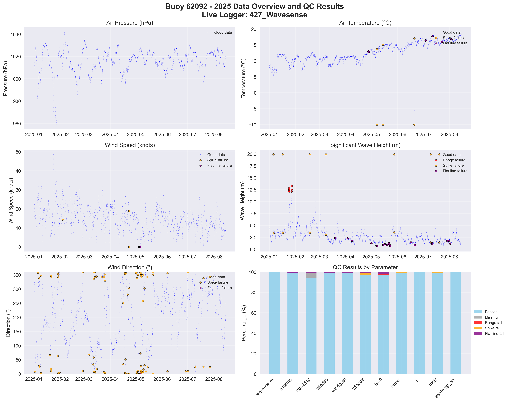

# Buoy 62092 - 2025 Quality Control Report

**Generated:** 2025-10-02 13:40:35

## Data Overview

- **Station ID:** 62092
- **Year:** 2025
- **Total Records:** 5,423
- **Time Range:** 2025-01-01 00:00:00 to 2025-08-14 23:00:00
- **Duration:** 225 days
- **Sensors/Loggers:** 1 active
  - 427_Wavesense: 5,423 records (100.0%)
- **Live Logger Used:** 427_Wavesense
  - Active Period: 2024-01-17 00:00 to Present
  - Wave Data Available: No
  - Notes: No MD File Received

## Quality Control Results

### Record-Level QC Status

- **QC complete:** 5,197 records (95.8%)
- **No QC performed:** 226 records (4.2%)

### Parameter-Level QC Results

| Parameter | Total | Missing | Range Fail | Spike Fail | Flat Line Fail | Passed | Pass Rate |
|-----------|--------|---------|------------|------------|----------------|--------|-----------|
| airpressure | 5,423 | 0 | 0 | 0 | 0 | 5,423 | 100.0% |
| airtemp | 5,423 | 0 | 0 | 6 | 32 | 5,385 | 99.3% |
| humidity | 5,423 | 245 | 0 | 3 | 68 | 5,108 | 94.2% |
| windsp | 5,423 | 0 | 0 | 3 | 47 | 5,373 | 99.1% |
| windgust | 5,423 | 0 | 4 | 2 | 47 | 5,370 | 99.0% |
| winddir | 5,423 | 0 | 0 | 99 | 47 | 5,277 | 97.3% |
| hm0 | 5,423 | 0 | 15 | 14 | 118 | 5,283 | 97.4% |
| hmax | 5,423 | 0 | 8 | 23 | 22 | 5,378 | 99.2% |
| tp | 5,423 | 0 | 0 | 11 | 5 | 5,407 | 99.7% |
| mdir | 5,423 | 0 | 0 | 45 | 5 | 5,373 | 99.1% |
| seatemp_aa | 5,423 | 0 | 0 | 0 | 0 | 5,423 | 100.0% |

### Issues Identified

- airtemp: 6 spike values (>5.0 change)
- airtemp: 32 flat line values (5+ consecutive identical)
- humidity: 3 spike values (>20.0 change)
- humidity: 68 flat line values (5+ consecutive identical)
- windsp: 3 spike values (>15.0 change)
- windsp: 47 flat line values (5+ consecutive identical)
- windgust: 4 values outside range [0.0-60.0]
- windgust: 2 spike values (>20.0 change)
- windgust: 47 flat line values (5+ consecutive identical)
- winddir: 99 spike values (>180.0 change)
- winddir: 47 flat line values (5+ consecutive identical)
- hm0: 15 values outside range [0.0-12.0]
- hm0: 14 spike values (>2.5 change)
- hm0: 118 flat line values (5+ consecutive identical)
- hmax: 8 values outside range [0.0-20.0]
- hmax: 23 spike values (>4.0 change)
- hmax: 22 flat line values (5+ consecutive identical)
- tp: 11 spike values (>10.0 change)
- tp: 5 flat line values (5+ consecutive identical)
- mdir: 45 spike values (>180.0 change)
- mdir: 5 flat line values (5+ consecutive identical)

## QC Limits Applied

Station-specific QC limits used for this analysis:

| Parameter | Min Value | Max Value | Spike Threshold | Notes |
|-----------|-----------|-----------|-----------------|-------|
| airpressure | 950.0 | 1050.0 | 10.0 | Default |
| airtemp | -20.0 | 40.0 | 5.0 | Default |
| humidity | 0.0 | 100.0 | 20.0 | Default |
| windsp | 0.0 | 50.0 | 15.0 | Default |
| windgust | 0.0 | 60.0 | 20.0 | Default |
| winddir | 0.0 | 360.0 | 180.0 | Default |
| hm0 | 0.0 | 12.0 | 2.5 | Station-specific |
| hmax | 0.0 | 20.0 | 4.0 | Station-specific |
| tp | 1.0 | 25.0 | 10.0 | Default |
| mdir | 0.0 | 360.0 | 180.0 | Default |
| seatemp_aa | 6.0 | 20.0 | 2.5 | Station-specific |

## Data Visualization

### QC Failure Color Coding

The visualization uses different colors to distinguish QC failure types:

- **Blue dots**: Good data (passed all QC tests)
- **Red dots**: Range failures (values outside physical limits)
- **Orange dots**: Spike failures (unrealistic sudden changes)
- **Purple dots**: Flat line failures (sensor stuck/malfunctioning)

The bottom-right panel shows a stacked bar chart with the percentage breakdown of each QC result type per parameter.

## Recommendations

### Manual QC Actions Needed

1. **Review flagged extreme values** - validate against weather events
2. **Investigate sensor failures** - replace/repair faulty sensors
3. **Cross-validate between loggers** - compare duplicate measurements
4. **Apply sensor hierarchy** - prioritize Wavesense for hm0, Datawell for hmax
5. **Transfer to production** - move QC'd data to irish_buoys_fugro table

### Next Steps

1. Execute parameter-level QC SQL commands from readme.md
2. Perform individual value corrections for flagged data
3. Complete record-level QC marking
4. Transfer approved data to production table
