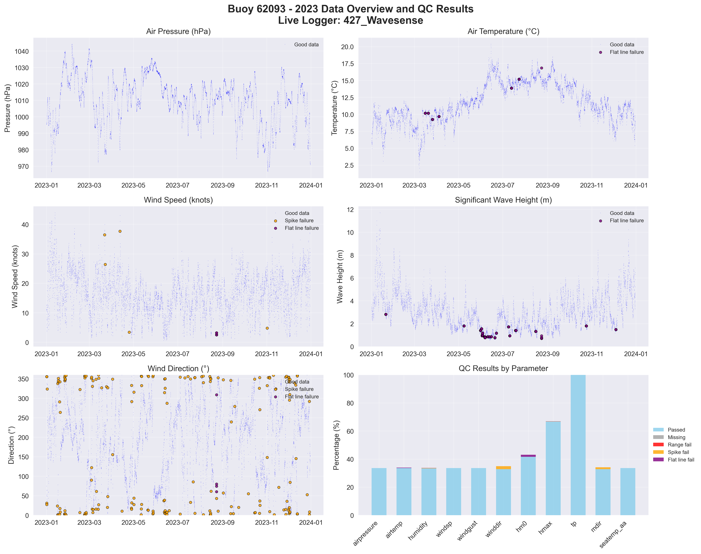

# Buoy 62093 - 2023 Quality Control Report

**Generated:** 2025-10-02 13:40:39

## Data Overview

- **Station ID:** 62093
- **Year:** 2023
- **Total Records:** 8,715
- **Time Range:** 2023-01-01 00:00:00 to 2023-12-30 23:00:00
- **Duration:** 363 days
- **Sensors/Loggers:** 2 active
  - 427_Wavesense: 5,607 records (64.3%)
  - 189_Wavesense: 3,108 records (35.7%)
- **Live Logger Used:** 427_Wavesense
  - Active Period: 2022-07-21 15:00 to 2023-08-22 18:00
  - Wave Data Available: No

## Quality Control Results

### Record-Level QC Status

- **QC complete:** 8,704 records (99.9%)
- **No QC performed:** 11 records (0.1%)

### Parameter-Level QC Results

| Parameter | Total | Missing | Range Fail | Spike Fail | Flat Line Fail | Passed | Pass Rate |
|-----------|--------|---------|------------|------------|----------------|--------|-----------|
| airpressure | 8,715 | 0 | 0 | 0 | 0 | 2,926 | 33.6% |
| airtemp | 8,715 | 0 | 0 | 0 | 30 | 2,926 | 33.6% |
| humidity | 8,715 | 0 | 0 | 13 | 12 | 2,911 | 33.4% |
| windsp | 8,715 | 0 | 0 | 5 | 0 | 2,925 | 33.6% |
| windgust | 8,715 | 0 | 1 | 6 | 0 | 2,924 | 33.6% |
| winddir | 8,715 | 0 | 0 | 191 | 0 | 2,856 | 32.8% |
| hm0 | 8,715 | 0 | 0 | 0 | 129 | 3,623 | 41.6% |
| hmax | 8,715 | 0 | 0 | 2 | 11 | 5,818 | 66.8% |
| tp | 8,715 | 0 | 0 | 2 | 0 | 8,713 | 100.0% |
| mdir | 8,715 | 0 | 0 | 115 | 0 | 2,863 | 32.9% |
| seatemp_aa | 8,715 | 0 | 0 | 0 | 0 | 2,926 | 33.6% |

### Issues Identified

- airtemp: 30 flat line values (5+ consecutive identical)
- humidity: 13 spike values (>20.0 change)
- humidity: 12 flat line values (5+ consecutive identical)
- windsp: 5 spike values (>15.0 change)
- windgust: 1 values outside range [0.0-60.0]
- windgust: 6 spike values (>20.0 change)
- winddir: 191 spike values (>180.0 change)
- hm0: 129 flat line values (5+ consecutive identical)
- hmax: 2 spike values (>5.0 change)
- hmax: 11 flat line values (5+ consecutive identical)
- tp: 2 spike values (>10.0 change)
- mdir: 115 spike values (>180.0 change)

## QC Limits Applied

Station-specific QC limits used for this analysis:

| Parameter | Min Value | Max Value | Spike Threshold | Notes |
|-----------|-----------|-----------|-----------------|-------|
| airpressure | 950.0 | 1050.0 | 10.0 | Default |
| airtemp | -20.0 | 40.0 | 5.0 | Default |
| humidity | 0.0 | 100.0 | 20.0 | Default |
| windsp | 0.0 | 50.0 | 15.0 | Default |
| windgust | 0.0 | 60.0 | 20.0 | Default |
| winddir | 0.0 | 360.0 | 180.0 | Default |
| hm0 | 0.0 | 15.0 | 3.5 | Station-specific |
| hmax | 0.0 | 25.0 | 5.0 | Station-specific |
| tp | 1.0 | 25.0 | 10.0 | Default |
| mdir | 0.0 | 360.0 | 180.0 | Default |
| seatemp_aa | 5.0 | 19.0 | 2.5 | Station-specific |

## Data Visualization

### QC Failure Color Coding

The visualization uses different colors to distinguish QC failure types:

- **Blue dots**: Good data (passed all QC tests)
- **Red dots**: Range failures (values outside physical limits)
- **Orange dots**: Spike failures (unrealistic sudden changes)
- **Purple dots**: Flat line failures (sensor stuck/malfunctioning)

The bottom-right panel shows a stacked bar chart with the percentage breakdown of each QC result type per parameter.

## Recommendations

### Manual QC Actions Needed

1. **Review flagged extreme values** - validate against weather events
2. **Investigate sensor failures** - replace/repair faulty sensors
3. **Cross-validate between loggers** - compare duplicate measurements
4. **Apply sensor hierarchy** - prioritize Wavesense for hm0, Datawell for hmax
5. **Transfer to production** - move QC'd data to irish_buoys_fugro table

### Next Steps

1. Execute parameter-level QC SQL commands from readme.md
2. Perform individual value corrections for flagged data
3. Complete record-level QC marking
4. Transfer approved data to production table
