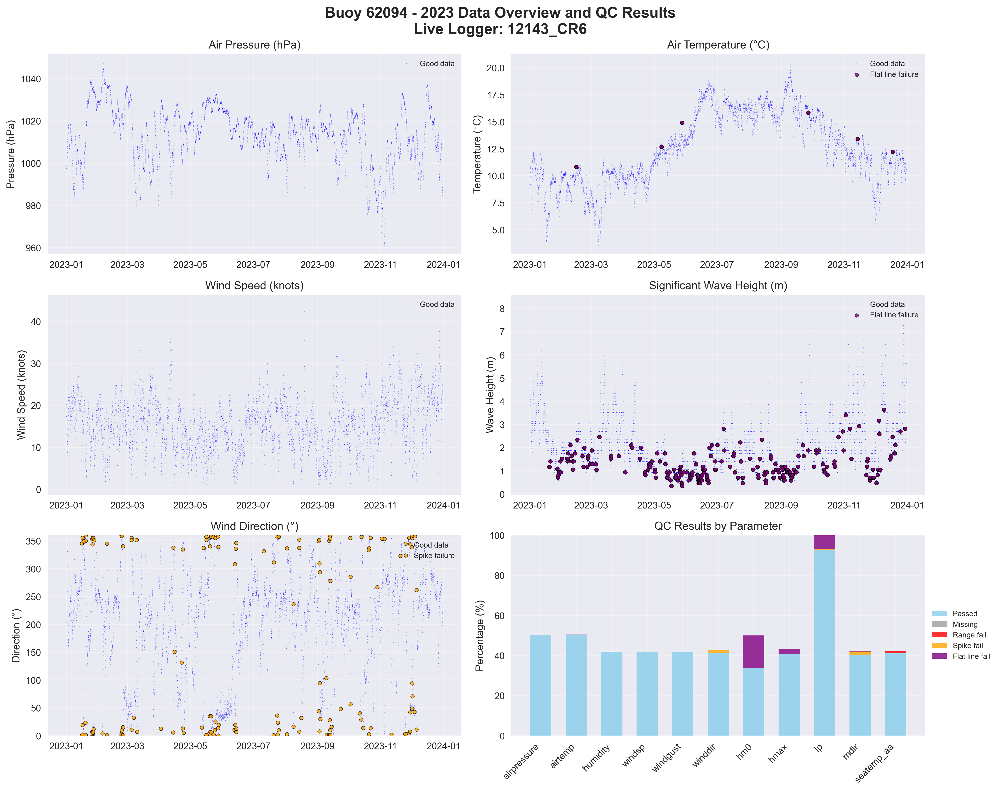

# Buoy 62094 - 2023 Quality Control Report

**Generated:** 2025-10-02 13:40:51

## Data Overview

- **Station ID:** 62094
- **Year:** 2023
- **Total Records:** 8,733
- **Time Range:** 2023-01-01 00:00:00 to 2023-12-30 23:00:00
- **Duration:** 363 days
- **Sensors/Loggers:** 2 active
  - 12143_CR6: 8,094 records (92.7%)
  - 189_Wavesense: 639 records (7.3%)
- **Live Logger Used:** 12143_CR6
  - Active Period: 2023-01-27 17:00 to 2024-07-13 09:00
  - Wave Data Available: Yes

## Quality Control Results

### Record-Level QC Status

- **QC complete:** 8,035 records (92.0%)
- **No QC performed:** 698 records (8.0%)

### Parameter-Level QC Results

| Parameter | Total | Missing | Range Fail | Spike Fail | Flat Line Fail | Passed | Pass Rate |
|-----------|--------|---------|------------|------------|----------------|--------|-----------|
| airpressure | 8,733 | 0 | 0 | 0 | 0 | 4,391 | 50.3% |
| airtemp | 8,733 | 0 | 0 | 0 | 31 | 4,370 | 50.0% |
| humidity | 8,733 | 0 | 0 | 3 | 5 | 3,643 | 41.7% |
| windsp | 8,733 | 0 | 0 | 0 | 0 | 3,648 | 41.8% |
| windgust | 8,733 | 0 | 1 | 1 | 0 | 3,648 | 41.8% |
| winddir | 8,733 | 0 | 0 | 151 | 0 | 3,581 | 41.0% |
| hm0 | 8,733 | 0 | 0 | 0 | 1,403 | 2,963 | 33.9% |
| hmax | 8,733 | 0 | 0 | 0 | 228 | 3,551 | 40.7% |
| tp | 8,733 | 0 | 0 | 48 | 609 | 8,077 | 92.5% |
| mdir | 8,733 | 0 | 0 | 164 | 16 | 3,498 | 40.1% |
| seatemp_aa | 8,733 | 0 | 84 | 0 | 0 | 3,589 | 41.1% |

### Issues Identified

- airtemp: 31 flat line values (5+ consecutive identical)
- humidity: 3 spike values (>20.0 change)
- humidity: 5 flat line values (5+ consecutive identical)
- windgust: 1 values outside range [0.0-60.0]
- windgust: 1 spike values (>20.0 change)
- winddir: 151 spike values (>180.0 change)
- hm0: 1403 flat line values (5+ consecutive identical)
- hmax: 228 flat line values (5+ consecutive identical)
- tp: 48 spike values (>10.0 change)
- tp: 609 flat line values (5+ consecutive identical)
- mdir: 164 spike values (>180.0 change)
- mdir: 16 flat line values (5+ consecutive identical)
- seatemp_aa: 84 values outside range [4.5-18.5]

## QC Limits Applied

Station-specific QC limits used for this analysis:

| Parameter | Min Value | Max Value | Spike Threshold | Notes |
|-----------|-----------|-----------|-----------------|-------|
| airpressure | 950.0 | 1050.0 | 10.0 | Default |
| airtemp | -20.0 | 40.0 | 5.0 | Default |
| humidity | 0.0 | 100.0 | 20.0 | Default |
| windsp | 0.0 | 55.0 | 18.0 | Station-specific |
| windgust | 0.0 | 60.0 | 20.0 | Default |
| winddir | 0.0 | 360.0 | 180.0 | Default |
| hm0 | 0.0 | 16.0 | 3.5 | Station-specific |
| hmax | 0.0 | 26.0 | 5.5 | Station-specific |
| tp | 1.0 | 25.0 | 10.0 | Default |
| mdir | 0.0 | 360.0 | 180.0 | Default |
| seatemp_aa | 4.5 | 18.5 | 2.5 | Station-specific |

## Data Visualization

### QC Failure Color Coding

The visualization uses different colors to distinguish QC failure types:

- **Blue dots**: Good data (passed all QC tests)
- **Red dots**: Range failures (values outside physical limits)
- **Orange dots**: Spike failures (unrealistic sudden changes)
- **Purple dots**: Flat line failures (sensor stuck/malfunctioning)

The bottom-right panel shows a stacked bar chart with the percentage breakdown of each QC result type per parameter.

## Recommendations

### Manual QC Actions Needed

1. **Review flagged extreme values** - validate against weather events
2. **Investigate sensor failures** - replace/repair faulty sensors
3. **Cross-validate between loggers** - compare duplicate measurements
4. **Apply sensor hierarchy** - prioritize Wavesense for hm0, Datawell for hmax
5. **Transfer to production** - move QC'd data to irish_buoys_fugro table

### Next Steps

1. Execute parameter-level QC SQL commands from readme.md
2. Perform individual value corrections for flagged data
3. Complete record-level QC marking
4. Transfer approved data to production table
