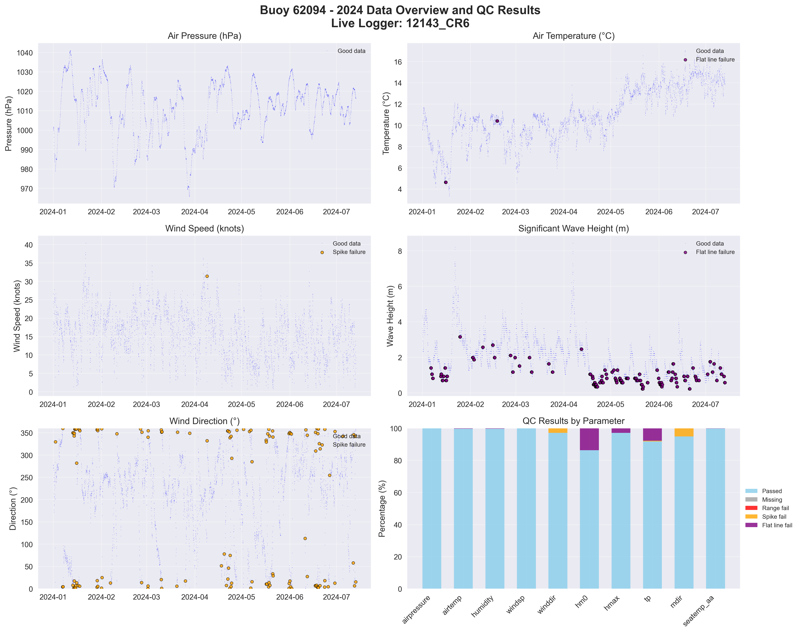

# Buoy 62094 - 2024 Quality Control Report

**Generated:** 2025-09-08 12:39:25

## Data Overview

- **Station ID:** 62094
- **Year:** 2024
- **Total Records:** 4,666
- **Time Range:** 2024-01-01 00:00:00 to 2024-07-13 09:00:00
- **Duration:** 194 days
- **Sensors/Loggers:** 1 active
  - 12143_CR6: 4,666 records (100.0%)
- **Live Logger Used:** 12143_CR6
  - Active Period: 2023-01-27 17:00 to 2024-07-13 09:00
  - Wave Data Available: Yes

## Quality Control Results

### Record-Level QC Status

- **QC complete:** 4,017 records (86.1%)
- **No QC performed:** 649 records (13.9%)

### Parameter-Level QC Results

| Parameter | Total | Missing | Range Fail | Spike Fail | Flat Line Fail | Passed | Pass Rate |
|-----------|--------|---------|------------|------------|----------------|--------|-----------|
| airpressure | 4,666 | 0 | 0 | 0 | 0 | 4,666 | 100.0% |
| airtemp | 4,666 | 0 | 0 | 0 | 10 | 4,656 | 99.8% |
| humidity | 4,666 | 0 | 0 | 1 | 11 | 4,654 | 99.7% |
| windsp | 4,666 | 0 | 0 | 1 | 0 | 4,665 | 100.0% |
| winddir | 4,666 | 0 | 0 | 131 | 0 | 4,535 | 97.2% |
| hm0 | 4,666 | 0 | 0 | 0 | 638 | 4,028 | 86.3% |
| hmax | 4,666 | 0 | 0 | 0 | 130 | 4,536 | 97.2% |
| tp | 4,666 | 0 | 0 | 21 | 364 | 4,282 | 91.8% |
| mdir | 4,666 | 0 | 0 | 238 | 0 | 4,428 | 94.9% |
| seatemp_aa | 4,666 | 0 | 0 | 0 | 5 | 4,661 | 99.9% |

### Issues Identified

- airtemp: 10 flat line values (5+ consecutive identical)
- humidity: 1 spike values (>20.0 change)
- humidity: 11 flat line values (5+ consecutive identical)
- windsp: 1 spike values (>18.0 change)
- winddir: 131 spike values (>180.0 change)
- hm0: 638 flat line values (5+ consecutive identical)
- hmax: 130 flat line values (5+ consecutive identical)
- tp: 21 spike values (>10.0 change)
- tp: 364 flat line values (5+ consecutive identical)
- mdir: 238 spike values (>180.0 change)
- seatemp_aa: 5 flat line values (5+ consecutive identical)

## QC Limits Applied

Station-specific QC limits used for this analysis:

| Parameter | Min Value | Max Value | Spike Threshold | Notes |
|-----------|-----------|-----------|-----------------|-------|
| airpressure | 950.0 | 1050.0 | 10.0 | Default |
| airtemp | -20.0 | 40.0 | 5.0 | Default |
| humidity | 0.0 | 100.0 | 20.0 | Default |
| windsp | 0.0 | 55.0 | 18.0 | Station-specific |
| winddir | 0.0 | 360.0 | 180.0 | Default |
| hm0 | 0.0 | 16.0 | 3.5 | Station-specific |
| hmax | 0.0 | 26.0 | 5.5 | Station-specific |
| tp | 1.0 | 25.0 | 10.0 | Default |
| mdir | 0.0 | 360.0 | 180.0 | Default |
| seatemp_aa | 4.5 | 18.5 | 2.5 | Station-specific |

## Data Visualization

### QC Failure Color Coding

The visualization uses different colors to distinguish QC failure types:

- **Blue dots**: Good data (passed all QC tests)
- **Red dots**: Range failures (values outside physical limits)
- **Orange dots**: Spike failures (unrealistic sudden changes)
- **Purple dots**: Flat line failures (sensor stuck/malfunctioning)

The bottom-right panel shows a stacked bar chart with the percentage breakdown of each QC result type per parameter.

## Recommendations

### Manual QC Actions Needed

1. **Review flagged extreme values** - validate against weather events
2. **Investigate sensor failures** - replace/repair faulty sensors
3. **Cross-validate between loggers** - compare duplicate measurements
4. **Apply sensor hierarchy** - prioritize Wavesense for hm0, Datawell for hmax
5. **Transfer to production** - move QC'd data to irish_buoys_fugro table

### Next Steps

1. Execute parameter-level QC SQL commands from readme.md
2. Perform individual value corrections for flagged data
3. Complete record-level QC marking
4. Transfer approved data to production table
