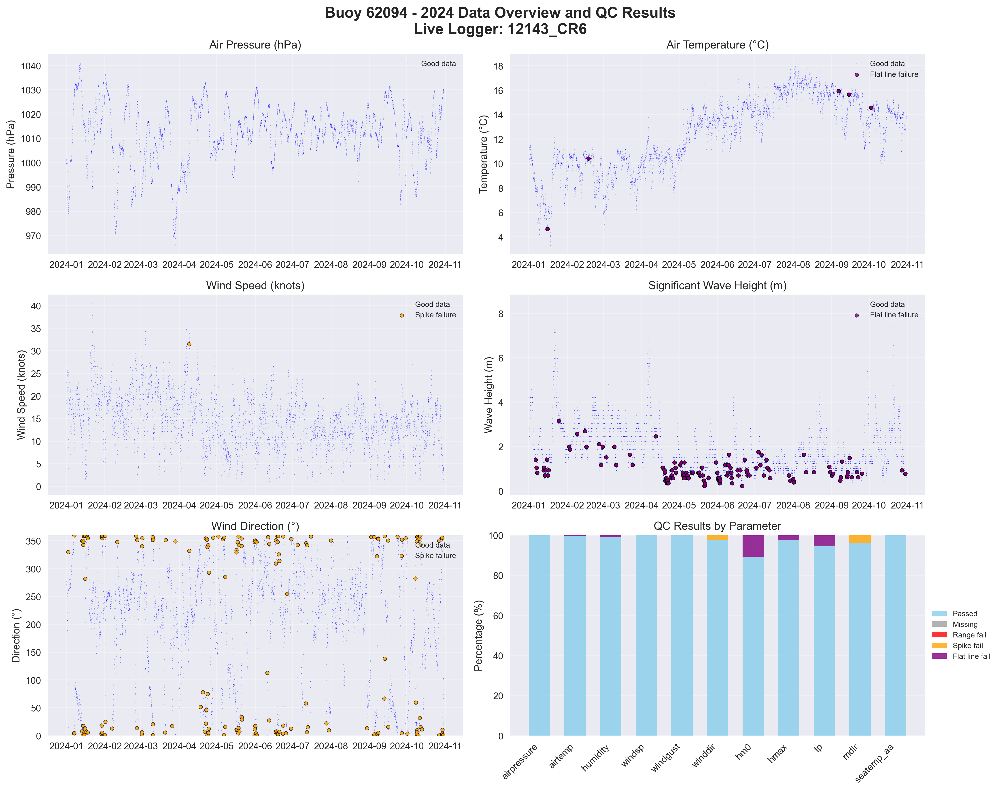

# Buoy 62094 - 2024 Quality Control Report

**Generated:** 2025-10-02 13:40:55

## Data Overview

- **Station ID:** 62094
- **Year:** 2024
- **Total Records:** 7,249
- **Time Range:** 2024-01-01 00:00:00 to 2024-10-30 23:00:00
- **Duration:** 303 days
- **Sensors/Loggers:** 2 active
  - 12143_CR6: 4,666 records (64.4%)
  - 347_Wavesense: 2,583 records (35.6%)
- **Live Logger Used:** 12143_CR6
  - Active Period: 2023-01-27 17:00 to 2024-07-13 09:00
  - Wave Data Available: Yes

## Quality Control Results

### Record-Level QC Status

- **QC complete:** 6,444 records (88.9%)
- **No QC performed:** 805 records (11.1%)

### Parameter-Level QC Results

| Parameter | Total | Missing | Range Fail | Spike Fail | Flat Line Fail | Passed | Pass Rate |
|-----------|--------|---------|------------|------------|----------------|--------|-----------|
| airpressure | 7,249 | 0 | 0 | 0 | 0 | 7,249 | 100.0% |
| airtemp | 7,249 | 0 | 0 | 0 | 25 | 7,224 | 99.7% |
| humidity | 7,249 | 0 | 0 | 4 | 49 | 7,197 | 99.3% |
| windsp | 7,249 | 0 | 0 | 1 | 0 | 7,248 | 100.0% |
| windgust | 7,249 | 0 | 0 | 1 | 0 | 7,248 | 100.0% |
| winddir | 7,249 | 0 | 0 | 179 | 0 | 7,070 | 97.5% |
| hm0 | 7,249 | 0 | 0 | 0 | 779 | 6,470 | 89.3% |
| hmax | 7,249 | 0 | 0 | 0 | 164 | 7,085 | 97.7% |
| tp | 7,249 | 0 | 0 | 27 | 374 | 6,849 | 94.5% |
| mdir | 7,249 | 0 | 0 | 285 | 5 | 6,959 | 96.0% |
| seatemp_aa | 7,249 | 0 | 1 | 2 | 5 | 7,242 | 99.9% |

### Issues Identified

- airtemp: 25 flat line values (5+ consecutive identical)
- humidity: 4 spike values (>20.0 change)
- humidity: 49 flat line values (5+ consecutive identical)
- windsp: 1 spike values (>18.0 change)
- windgust: 1 spike values (>20.0 change)
- winddir: 179 spike values (>180.0 change)
- hm0: 779 flat line values (5+ consecutive identical)
- hmax: 164 flat line values (5+ consecutive identical)
- tp: 27 spike values (>10.0 change)
- tp: 374 flat line values (5+ consecutive identical)
- mdir: 285 spike values (>180.0 change)
- mdir: 5 flat line values (5+ consecutive identical)
- seatemp_aa: 1 values outside range [4.5-18.5]
- seatemp_aa: 2 spike values (>2.5 change)
- seatemp_aa: 5 flat line values (5+ consecutive identical)

## QC Limits Applied

Station-specific QC limits used for this analysis:

| Parameter | Min Value | Max Value | Spike Threshold | Notes |
|-----------|-----------|-----------|-----------------|-------|
| airpressure | 950.0 | 1050.0 | 10.0 | Default |
| airtemp | -20.0 | 40.0 | 5.0 | Default |
| humidity | 0.0 | 100.0 | 20.0 | Default |
| windsp | 0.0 | 55.0 | 18.0 | Station-specific |
| windgust | 0.0 | 60.0 | 20.0 | Default |
| winddir | 0.0 | 360.0 | 180.0 | Default |
| hm0 | 0.0 | 16.0 | 3.5 | Station-specific |
| hmax | 0.0 | 26.0 | 5.5 | Station-specific |
| tp | 1.0 | 25.0 | 10.0 | Default |
| mdir | 0.0 | 360.0 | 180.0 | Default |
| seatemp_aa | 4.5 | 18.5 | 2.5 | Station-specific |

## Data Visualization

### QC Failure Color Coding

The visualization uses different colors to distinguish QC failure types:

- **Blue dots**: Good data (passed all QC tests)
- **Red dots**: Range failures (values outside physical limits)
- **Orange dots**: Spike failures (unrealistic sudden changes)
- **Purple dots**: Flat line failures (sensor stuck/malfunctioning)

The bottom-right panel shows a stacked bar chart with the percentage breakdown of each QC result type per parameter.

## Recommendations

### Manual QC Actions Needed

1. **Review flagged extreme values** - validate against weather events
2. **Investigate sensor failures** - replace/repair faulty sensors
3. **Cross-validate between loggers** - compare duplicate measurements
4. **Apply sensor hierarchy** - prioritize Wavesense for hm0, Datawell for hmax
5. **Transfer to production** - move QC'd data to irish_buoys_fugro table

### Next Steps

1. Execute parameter-level QC SQL commands from readme.md
2. Perform individual value corrections for flagged data
3. Complete record-level QC marking
4. Transfer approved data to production table
