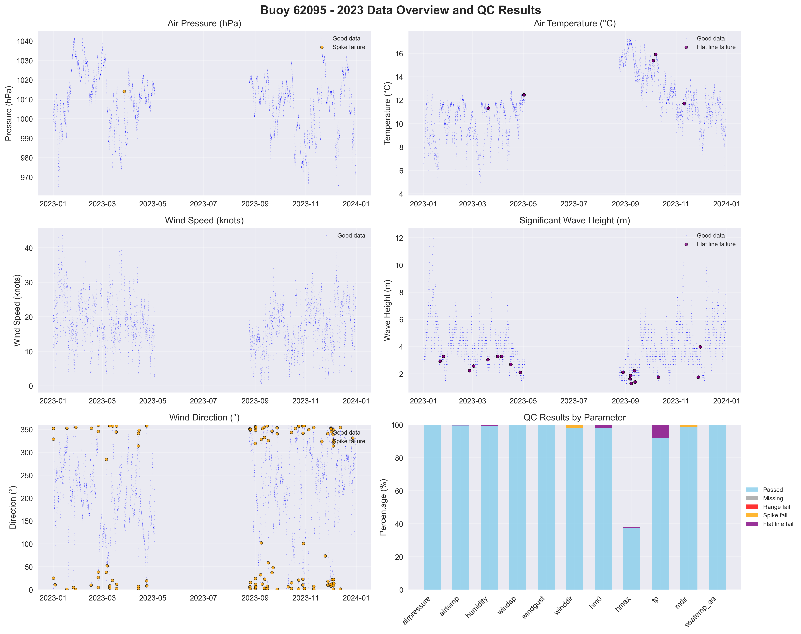

# Buoy 62095 - 2023 Quality Control Report

**Generated:** 2025-10-02 13:41:02

## Data Overview

- **Station ID:** 62095
- **Year:** 2023
- **Total Records:** 5,948
- **Time Range:** 2023-01-01 00:00:00 to 2023-12-30 23:00:00
- **Duration:** 363 days
- **Sensors/Loggers:** 2 active
  - 12145_CR6: 3,087 records (51.9%)
  - 7577_CR6: 2,861 records (48.1%)
- **Live Logger:** None identified for this time period

## Quality Control Results

### Record-Level QC Status

- **QC complete:** 5,817 records (97.8%)
- **No QC performed:** 131 records (2.2%)

### Parameter-Level QC Results

| Parameter | Total | Missing | Range Fail | Spike Fail | Flat Line Fail | Passed | Pass Rate |
|-----------|--------|---------|------------|------------|----------------|--------|-----------|
| airpressure | 5,948 | 0 | 0 | 1 | 0 | 5,947 | 100.0% |
| airtemp | 5,948 | 0 | 0 | 0 | 25 | 5,923 | 99.6% |
| humidity | 5,948 | 0 | 0 | 4 | 51 | 5,893 | 99.1% |
| windsp | 5,948 | 0 | 0 | 0 | 0 | 5,948 | 100.0% |
| windgust | 5,948 | 0 | 2 | 2 | 0 | 5,945 | 99.9% |
| winddir | 5,948 | 0 | 0 | 124 | 0 | 5,824 | 97.9% |
| hm0 | 5,948 | 0 | 0 | 0 | 105 | 5,843 | 98.2% |
| hmax | 5,948 | 0 | 0 | 5 | 5 | 2,235 | 37.6% |
| tp | 5,948 | 0 | 0 | 1 | 487 | 5,460 | 91.8% |
| mdir | 5,948 | 0 | 0 | 79 | 0 | 5,869 | 98.7% |
| seatemp_aa | 5,948 | 0 | 0 | 1 | 12 | 5,935 | 99.8% |

### Issues Identified

- airpressure: 1 spike values (>10.0 change)
- airtemp: 25 flat line values (5+ consecutive identical)
- humidity: 4 spike values (>20.0 change)
- humidity: 51 flat line values (5+ consecutive identical)
- windgust: 2 values outside range [0.0-60.0]
- windgust: 2 spike values (>20.0 change)
- winddir: 124 spike values (>180.0 change)
- hm0: 105 flat line values (5+ consecutive identical)
- hmax: 5 spike values (>4.5 change)
- hmax: 5 flat line values (5+ consecutive identical)
- tp: 1 spike values (>10.0 change)
- tp: 487 flat line values (5+ consecutive identical)
- mdir: 79 spike values (>180.0 change)
- seatemp_aa: 1 spike values (>2.0 change)
- seatemp_aa: 12 flat line values (5+ consecutive identical)

## QC Limits Applied

Station-specific QC limits used for this analysis:

| Parameter | Min Value | Max Value | Spike Threshold | Notes |
|-----------|-----------|-----------|-----------------|-------|
| airpressure | 950.0 | 1050.0 | 10.0 | Default |
| airtemp | -15.0 | 35.0 | 4.0 | Station-specific |
| humidity | 0.0 | 100.0 | 20.0 | Default |
| windsp | 0.0 | 50.0 | 15.0 | Default |
| windgust | 0.0 | 60.0 | 20.0 | Default |
| winddir | 0.0 | 360.0 | 180.0 | Default |
| hm0 | 0.0 | 14.0 | 3.0 | Station-specific |
| hmax | 0.0 | 22.0 | 4.5 | Station-specific |
| tp | 1.0 | 25.0 | 10.0 | Default |
| mdir | 0.0 | 360.0 | 180.0 | Default |
| seatemp_aa | 6.0 | 19.0 | 2.0 | Station-specific |

## Data Visualization

### QC Failure Color Coding

The visualization uses different colors to distinguish QC failure types:

- **Blue dots**: Good data (passed all QC tests)
- **Red dots**: Range failures (values outside physical limits)
- **Orange dots**: Spike failures (unrealistic sudden changes)
- **Purple dots**: Flat line failures (sensor stuck/malfunctioning)

The bottom-right panel shows a stacked bar chart with the percentage breakdown of each QC result type per parameter.

## Recommendations

### Manual QC Actions Needed

1. **Review flagged extreme values** - validate against weather events
2. **Investigate sensor failures** - replace/repair faulty sensors
3. **Cross-validate between loggers** - compare duplicate measurements
4. **Apply sensor hierarchy** - prioritize Wavesense for hm0, Datawell for hmax
5. **Transfer to production** - move QC'd data to irish_buoys_fugro table

### Next Steps

1. Execute parameter-level QC SQL commands from readme.md
2. Perform individual value corrections for flagged data
3. Complete record-level QC marking
4. Transfer approved data to production table
