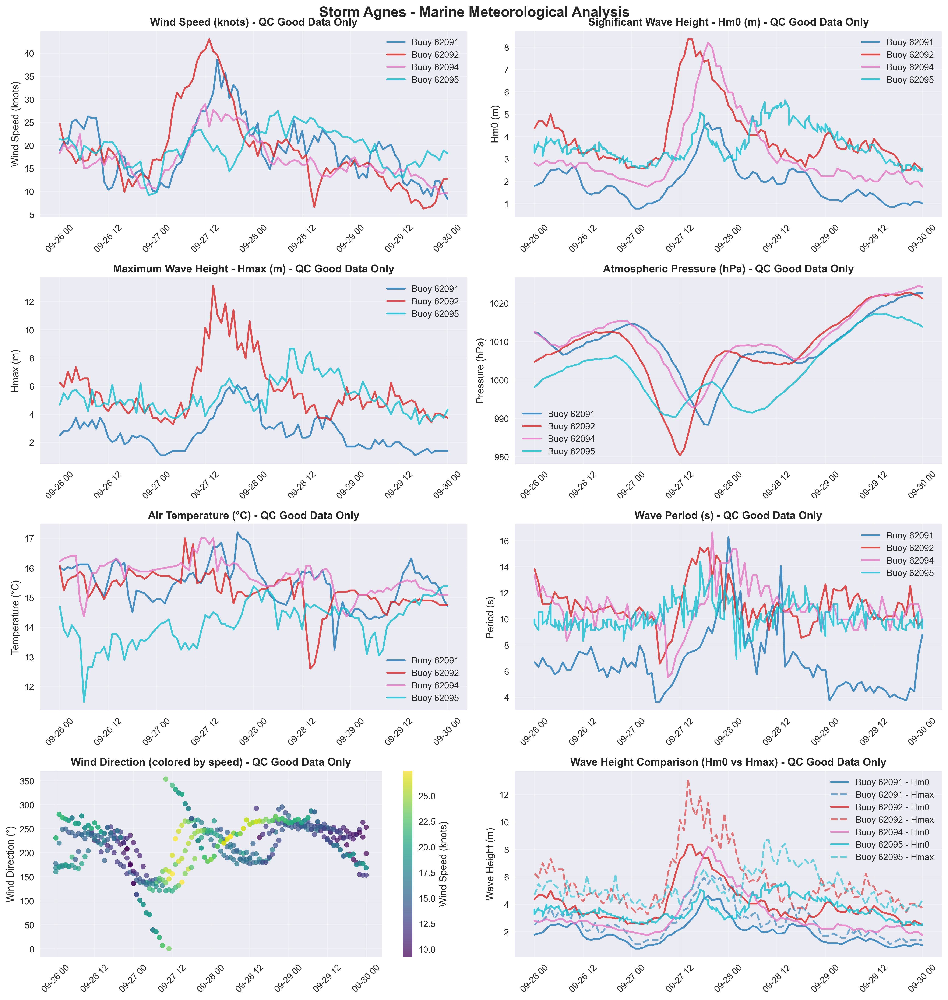

# Storm Agnes - Marine Storm Report

**Report Generated:** 2025-09-01 13:32:11

## Marine Observations Summary

### Data Sources
- **Buoy 62091** (M1 Buoy (Retired)): 53.47°N, 5.42°W
- **Buoy 62092** (M2 Buoy): 53.48°N, 5.42°W
- **Buoy 62094** (M4 Buoy): 51.69°N, 6.70°W
- **Buoy 62095** (M5 Buoy): 53.06°N, 7.90°W

### Peak Conditions Observed

- **Maximum Wind Speed:** 43.1 knots (79.7 km/h) at Buoy 62092
- **Maximum Significant Wave Height (Hm0):** 8.4 m at Buoy 62092
- **Maximum Wave Height (Hmax):** 13.1 m at Buoy 62092
- **Minimum Pressure:** 980.4 hPa at Buoy 62092
- **Temperature Range:** 11.5°C (Buoy 62095) to 17.2°C (Buoy 62091)
- **Total Observations:** 482 records from 4 stations (QC good data only)

### Station-by-Station Analysis

### Buoy 62091 - M1 Buoy (Retired)
- **Location:** 53.47°N, 5.42°W
- **Peak Wind Speed:** 38.6 knots (71.5 km/h)
- **Peak Significant Wave Height (Hm0):** 4.6 m  
- **Peak Maximum Wave Height (Hmax):** 6.1 m
- **Minimum Pressure:** 988.3 hPa
- **Data Quality:** Excellent (100.0% good data)
- **Observations:** 97 records (QC good data only)

### Buoy 62092 - M2 Buoy
- **Location:** 53.48°N, 5.42°W
- **Peak Wind Speed:** 43.1 knots (79.7 km/h)
- **Peak Significant Wave Height (Hm0):** 8.4 m  
- **Peak Maximum Wave Height (Hmax):** 13.1 m
- **Minimum Pressure:** 980.4 hPa
- **Data Quality:** Excellent (100.0% good data)
- **Observations:** 97 records (QC good data only)

### Buoy 62094 - M4 Buoy
- **Location:** 51.69°N, 6.70°W
- **Peak Wind Speed:** 28.9 knots (53.6 km/h)
- **Peak Significant Wave Height (Hm0):** 8.2 m  
- **Peak Maximum Wave Height (Hmax):** 0.0 m
- **Minimum Pressure:** 992.8 hPa
- **Data Quality:** Excellent (100.0% good data)
- **Observations:** 97 records (QC good data only)

### Buoy 62095 - M5 Buoy
- **Location:** 53.06°N, 7.90°W
- **Peak Wind Speed:** 27.4 knots (50.8 km/h)
- **Peak Significant Wave Height (Hm0):** 5.6 m  
- **Peak Maximum Wave Height (Hmax):** 8.7 m
- **Minimum Pressure:** 990.4 hPa
- **Data Quality:** Excellent (100.0% good data)
- **Observations:** 191 records (QC good data only)

## Meteorological Analysis

### Wind Analysis

The storm produced maximum sustained winds of **43.1 knots** (79.7 km/h).

**Wind Categories:**
- Force 7 — Near gale: 28–33 kn (50–61 km/h)
- Force 8 — Gale: 34–40 kn (62–74 km/h)
- Force 9 — Severe gale (aka Strong gale): 41–47 kn (75–88 km/h)
- Force 10 — Storm: 48–55 kn (89–102 km/h)
- Force 11 — Violent storm: 56–63 kn (103–117 km/h)
- Force 12 — Hurricane force: ≥64 kn (≥118 km/h)

### Wave Analysis  

**Significant Wave Heights (Hm0):** Peak values reached **8.4 m**, representing **high**.

**Maximum Wave Heights (Hmax):** Individual wave heights peaked at **13.1 m**. Note: Hmax values represent individual wave heights and are not used for sea state classification.

**Wave Height Relationship:** The Hmax/Hm0 ratio was **1.57**, within normal range (1.3-1.8).

**Sea State Classification (Hm0):**
- Rough: 2.5-4.0 m
- Very Rough: 4.0-6.0 m
- High: 6.0-9.0 m
- Very High: 9.0-14.0 m
- Phenomenal: >14.0 m

**Wave Height Definitions:**
- **Hm0 (Significant Wave Height):** Average height of the highest one-third of waves
- **Hmax (Maximum Wave Height):** Highest individual wave recorded during the period

### Pressure Analysis

Atmospheric pressure dropped to a minimum of **980.4 hPa**.

## Quality Control Summary

**Total Records:** 482

**QC Status Distribution:**
- Good Data (QC=1): 482 records (100.0%)
- Adjusted Data (QC=5): 0 records (0.0%)
- Missing Data (QC=9): 0 records (0.0%)
- No QC (QC=0): 0 records (0.0%)

## Data Sources and Logger Information

### Active Logger Information During Storm Period

**Buoy 62091 (M1 Buoy (Retired)):**
- Logger(s) used: 347_Wavesense  , 8704_CR6       

**Buoy 62092 (M2 Buoy):**
- Logger(s) used: 314_Wavesense  , 12146_CR6      

**Buoy 62094 (M4 Buoy):**
- Logger(s) used: 12142_CR6      , 12143_CR6      

**Buoy 62095 (M5 Buoy):**
- Logger(s) used: 12145_CR6      , 341_Wavesense  

**Note:** This report uses only quality-controlled data (QC indicators 1 and 5) for meteorological analysis. Logger information shows which data acquisition systems were active during the storm period.

## Data Visualization

*Figure 1: Comprehensive marine meteorological analysis showing wind speed, wave height, atmospheric pressure, air temperature, wind direction, and wave period during Storm Agnes.*

## Technical Notes

### QC Methods Applied
- **Manual QC:** Visual inspection and expert validation
- **Automatic QC:** Range checks, spike detection, and flat-line identification

### Data Quality Indicators
- 0: No QC performed
- 1: QC performed, data OK
- 4: QC performed, raw data not OK and not adjusted
- 5: QC performed, raw data not OK but value adjusted/interpolated
- 6: QC performed, data OK (Datawell Hmax sensor specific)
- 9: Data missing

---

*Report generated by Marine Storm Analysis System*
*Data source: Irish Marine Data Buoy Network*
*Quality controlled data from Met Éireann marine observations*
