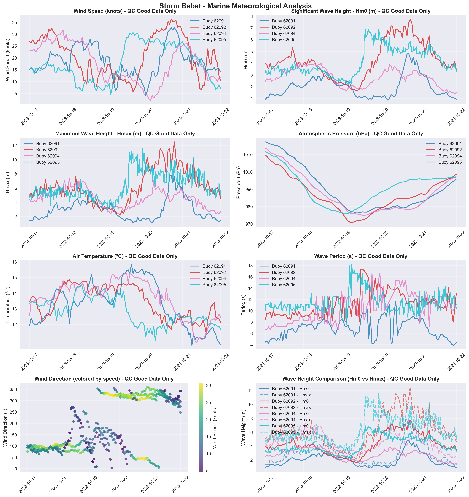

# Storm Babet - Marine Storm Report

**Report Generated:** 2025-08-20 13:41:31

## Storm Overview

**Dates:** 2023-10-18, 2023-10-19, 2023-10-20

**Description:** Severe storm bringing flooding and destructive winds across Ireland and UK.

**Peak Winds:** 100+ km/h

**Areas Affected:** East Coast, Southeast, Midlands

## Marine Observations Summary

### Data Sources
- **Buoy 62091** (M1 Buoy): 53.47°N, 5.42°W - West Coast
- **Buoy 62092** (M2 Buoy): 53.48°N, 5.42°W - West Coast
- **Buoy 62093** (M3 Buoy): 51.22°N, 6.70°W - Southwest Coast
- **Buoy 62094** (M4 Buoy): 51.69°N, 6.70°W - Southwest Coast
- **Buoy 62095** (M5 Buoy): 53.06°N, 7.90°W - West Coast

### Peak Conditions Observed

- **Maximum Wind Speed:** 36.2 m/s (130.4 km/h) at Buoy 62092
- **Maximum Significant Wave Height (Hm0):** 7.7 m at Buoy 62092
- **Maximum Wave Height (Hmax):** 13.3 m at Buoy 62092
- **Minimum Pressure:** 970.6 hPa at Buoy 62092
- **Temperature Range:** 10.0°C (Buoy 62093) to 15.5°C (Buoy 62091)
- **Total Observations:** 1,151 records from 5 stations (QC good data only)

### Station-by-Station Analysis

### Buoy 62091 - M1 Buoy
- **Location:** 53.47°N, 5.42°W
- **Region:** West Coast
- **Peak Wind Speed:** 32.8 m/s (118.1 km/h)
- **Peak Significant Wave Height (Hm0):** 4.8 m  
- **Peak Maximum Wave Height (Hmax):** 8.4 m
- **Minimum Pressure:** 976.3 hPa
- **Data Quality:** Excellent (100.0% good data)
- **Observations:** 223 records (QC good data only)

### Buoy 62092 - M2 Buoy
- **Location:** 53.48°N, 5.42°W
- **Region:** West Coast
- **Peak Wind Speed:** 36.2 m/s (130.4 km/h)
- **Peak Significant Wave Height (Hm0):** 7.7 m  
- **Peak Maximum Wave Height (Hmax):** 13.3 m
- **Minimum Pressure:** 970.6 hPa
- **Data Quality:** Excellent (100.0% good data)
- **Observations:** 236 records (QC good data only)

### Buoy 62093 - M3 Buoy
- **Location:** 51.22°N, 6.70°W
- **Region:** Southwest Coast
- **Peak Wind Speed:** 25.4 m/s (91.4 km/h)
- **Peak Significant Wave Height (Hm0):** 5.3 m  
- **Peak Maximum Wave Height (Hmax):** 9.1 m
- **Minimum Pressure:** 975.3 hPa
- **Data Quality:** Excellent (100.0% good data)
- **Observations:** 219 records (QC good data only)

### Buoy 62094 - M4 Buoy
- **Location:** 51.69°N, 6.70°W
- **Region:** Southwest Coast
- **Peak Wind Speed:** 31.8 m/s (114.4 km/h)
- **Peak Significant Wave Height (Hm0):** 4.1 m  
- **Peak Maximum Wave Height (Hmax):** 7.3 m
- **Minimum Pressure:** 974.9 hPa
- **Data Quality:** Excellent (100.0% good data)
- **Observations:** 236 records (QC good data only)

### Buoy 62095 - M5 Buoy
- **Location:** 53.06°N, 7.90°W
- **Region:** West Coast
- **Peak Wind Speed:** 30.6 m/s (110.3 km/h)
- **Peak Significant Wave Height (Hm0):** 6.9 m  
- **Peak Maximum Wave Height (Hmax):** 11.6 m
- **Minimum Pressure:** 976.0 hPa
- **Data Quality:** Excellent (100.0% good data)
- **Observations:** 237 records (QC good data only)

## Meteorological Analysis

### Wind Analysis

The storm produced maximum sustained winds of **36.2 m/s** (130.4 km/h), representing significant marine weather conditions. Wind speeds of this magnitude pose considerable risks to marine operations and coastal areas.

**Wind Categories:**
- Force 7 (Strong Gale): 13.9-17.1 m/s (50-61 km/h)
- Force 8 (Gale): 17.2-20.7 m/s (62-74 km/h)  
- Force 9 (Strong Gale): 20.8-24.4 m/s (75-88 km/h)
- Force 10+ (Storm): >24.5 m/s (>88 km/h)

### Wave Analysis  

**Significant Wave Heights (Hm0):** Peak values reached **7.7 m**, representing **high** sea states according to the World Meteorological Organization classification.

**Maximum Wave Heights (Hmax):** Individual wave heights peaked at **13.3 m**, representing **very high** conditions for maximum wave heights.

**Wave Height Relationship:** The Hmax/Hm0 ratio was **1.72**, within normal range (1.3-1.8).

**Sea State Classification (Hm0):**
- Rough: 2.5-4.0 m
- Very Rough: 4.0-6.0 m
- High: 6.0-9.0 m
- Very High: 9.0-14.0 m
- Phenomenal: >14.0 m

**Wave Height Definitions:**
- **Hm0 (Significant Wave Height):** Average height of the highest one-third of waves
- **Hmax (Maximum Wave Height):** Highest individual wave recorded during the period

### Pressure Analysis

Atmospheric pressure dropped to a minimum of **970.6 hPa**, representing a pressure anomaly of 42.7 hPa below standard atmospheric pressure (1013.25 hPa).

**Pressure Categories:**
- Normal: 1013-1023 hPa
- Low: 1000-1013 hPa
- Very Low: 980-1000 hPa  
- Extremely Low: <980 hPa

## Storm Timeline

**Storm Period:** 2023-10-17 00:00 to 2023-10-22 00:00 UTC

**Duration:** 5 days, 0 hours

**Key Timeline Points:**
- Storm approach: Pressure began dropping and winds increased
- Peak intensity: Maximum winds and waves recorded
- Storm passage: Gradual improvement in conditions

## Quality Control Summary

**Total Records:** 1,151

**QC Status Distribution:**
- Good Data (QC=1): 1,151 records (100.0%)
- Adjusted Data (QC=5): 0 records (0.0%)
- Failed QC (QC=4): 0 records (0.0%)
- Missing Data (QC=9): 0 records (0.0%)
- No QC (QC=0): 0 records (0.0%)

## Data Visualization

*Figure 1: Comprehensive marine meteorological analysis showing wind speed, wave height, atmospheric pressure, air temperature, wind direction, and wave period during Storm Babet.*

## Technical Notes

### QC Methods Applied
- **Manual QC:** Visual inspection and expert validation
- **Automatic QC:** Range checks, spike detection, and flat-line identification  
- **AI-powered QC:** Machine learning algorithms for anomaly detection

### Data Quality Indicators
- 0: No QC performed
- 1: QC performed, data OK
- 4: QC performed, raw data not OK and not adjusted
- 5: QC performed, raw data not OK but value adjusted/interpolated
- 6: QC performed, data OK (Datawell Hmax sensor specific)
- 9: Data missing

### Measurement Uncertainties
- Wind Speed: ±0.3 m/s
- Wave Height: ±5% or 0.5m (whichever greater)
- Atmospheric Pressure: ±0.5 hPa
- Air Temperature: ±0.2°C

---

*Report generated by Marine Storm Analysis System*
*Data source: Irish Marine Data Buoy Network*
*Quality controlled data from Met Éireann marine observations*
