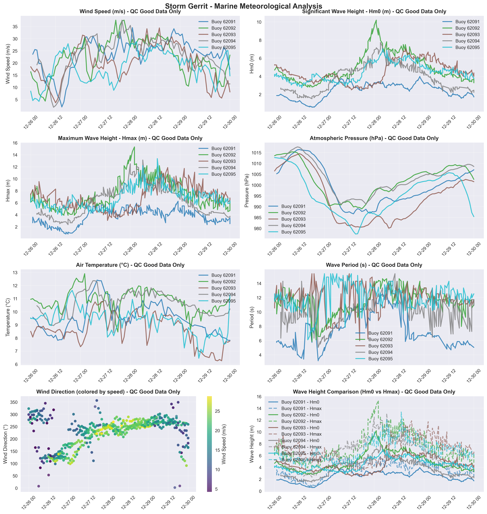

# Storm Gerrit - Marine Storm Report

**Report Generated:** 2025-08-25 13:36:40

## Storm Overview

**Dates:** 2023-12-27, 2023-12-28

**Description:** Post-Christmas storm with widespread impacts.

**Peak Winds:** 100+ km/h

**Areas Affected:** All areas

## Marine Observations Summary

### Data Sources
- **Buoy 62091** (M1 Buoy (Retired)): 53.47°N, 5.42°W - West Coast
- **Buoy 62092** (M2 Buoy): 53.48°N, 5.42°W - West Coast
- **Buoy 62093** (M3 Buoy): 51.22°N, 6.70°W - South Coast
- **Buoy 62094** (M4 Buoy): 51.69°N, 6.70°W - South Coast
- **Buoy 62095** (M5 Buoy): 53.06°N, 7.90°W - West Coast

### Peak Conditions Observed

- **Maximum Wind Speed:** 19.3 m/s (69.6 km/h) at Buoy 62092
- **Maximum Significant Wave Height (Hm0):** 10.2 m at Buoy 62092
- **Maximum Wave Height (Hmax):** 15.3 m at Buoy 62092
- **Minimum Pressure:** 977.4 hPa at Buoy 62095
- **Temperature Range:** 6.3°C (Buoy 62093) to 12.9°C (Buoy 62092)
- **Total Observations:** 932 records from 5 stations (QC good data only)

### Station-by-Station Analysis

### Buoy 62091 - M1 Buoy (Retired)
- **Location:** 53.47°N, 5.42°W
- **Region:** West Coast
- **Peak Wind Speed:** 17.8 m/s (63.9 km/h)
- **Peak Significant Wave Height (Hm0):** 4.0 m  
- **Peak Maximum Wave Height (Hmax):** 6.2 m
- **Minimum Pressure:** 986.7 hPa
- **Data Quality:** Excellent (100.0% good data)
- **Observations:** 186 records (QC good data only)

### Buoy 62092 - M2 Buoy
- **Location:** 53.48°N, 5.42°W
- **Region:** West Coast
- **Peak Wind Speed:** 19.3 m/s (69.6 km/h)
- **Peak Significant Wave Height (Hm0):** 10.2 m  
- **Peak Maximum Wave Height (Hmax):** 15.3 m
- **Minimum Pressure:** 989.0 hPa
- **Data Quality:** Excellent (100.0% good data)
- **Observations:** 194 records (QC good data only)

### Buoy 62093 - M3 Buoy
- **Location:** 51.22°N, 6.70°W
- **Region:** South Coast
- **Peak Wind Speed:** 17.7 m/s (63.7 km/h)
- **Peak Significant Wave Height (Hm0):** 7.0 m  
- **Peak Maximum Wave Height (Hmax):** 11.9 m
- **Minimum Pressure:** 980.1 hPa
- **Data Quality:** Excellent (100.0% good data)
- **Observations:** 188 records (QC good data only)

### Buoy 62094 - M4 Buoy
- **Location:** 51.69°N, 6.70°W
- **Region:** South Coast
- **Peak Wind Speed:** 19.3 m/s (69.6 km/h)
- **Peak Significant Wave Height (Hm0):** 7.7 m  
- **Peak Maximum Wave Height (Hmax):** 13.1 m
- **Minimum Pressure:** 991.1 hPa
- **Data Quality:** Excellent (100.0% good data)
- **Observations:** 177 records (QC good data only)

### Buoy 62095 - M5 Buoy
- **Location:** 53.06°N, 7.90°W
- **Region:** West Coast
- **Peak Wind Speed:** 14.8 m/s (53.4 km/h)
- **Peak Significant Wave Height (Hm0):** 7.0 m  
- **Peak Maximum Wave Height (Hmax):** 13.4 m
- **Minimum Pressure:** 977.4 hPa
- **Data Quality:** Excellent (100.0% good data)
- **Observations:** 187 records (QC good data only)

## Meteorological Analysis

### Wind Analysis

The storm produced maximum sustained winds of **19.3 m/s** (69.6 km/h), representing significant marine weather conditions. Wind speeds of this magnitude pose considerable risks to marine operations and coastal areas.

**Wind Categories:**
- Force 7 (Strong Gale): 13.9-17.1 m/s (50-61 km/h)
- Force 8 (Gale): 17.2-20.7 m/s (62-74 km/h)  
- Force 9 (Strong Gale): 20.8-24.4 m/s (75-88 km/h)
- Force 10+ (Storm): >24.5 m/s (>88 km/h)

### Wave Analysis  

**Significant Wave Heights (Hm0):** Peak values reached **10.2 m**, representing **very high** sea states according to the World Meteorological Organization classification.

**Maximum Wave Heights (Hmax):** Individual wave heights peaked at **15.3 m**. Note: Hmax values represent individual wave heights and are not used for sea state classification.

**Wave Height Relationship:** The Hmax/Hm0 ratio was **1.50**, within normal range (1.3-1.8).

**Sea State Classification (Hm0):**
- Rough: 2.5-4.0 m
- Very Rough: 4.0-6.0 m
- High: 6.0-9.0 m
- Very High: 9.0-14.0 m
- Phenomenal: >14.0 m

**Wave Height Definitions:**
- **Hm0 (Significant Wave Height):** Average height of the highest one-third of waves
- **Hmax (Maximum Wave Height):** Highest individual wave recorded during the period

## Quality Control Summary

**Total Records:** 932

**QC Status Distribution:**
- Good Data (QC=1): 932 records (100.0%)
- Adjusted Data (QC=5): 0 records (0.0%)
- Failed QC (QC=4): 0 records (0.0%)
- Missing Data (QC=9): 0 records (0.0%)
- No QC (QC=0): 0 records (0.0%)

## Data Visualization

*Figure 1: Marine meteorological analysis showing wind speed, wave height, atmospheric pressure, air temperature, wind direction, and wave period during Storm Gerrit.*

## Technical Notes

### QC Methods Applied
- **Manual QC:** Visual inspection and expert validation
- **Automatic QC:** Range checks, spike detection, and flat-line identification

### Data Quality Indicators
- 0: No QC performed
- 1: QC performed, data OK
- 4: QC performed, raw data not OK and not adjusted
- 5: QC performed, raw data not OK but value adjusted/interpolated
- 6: QC performed, data OK (Datawell Hmax sensor specific)
- 9: Data missing

---

*Report generated by Marine Storm Analysis System*
*Data source: Irish Marine Data Buoy Network*
*Quality controlled data from Met Éireann marine observations*
