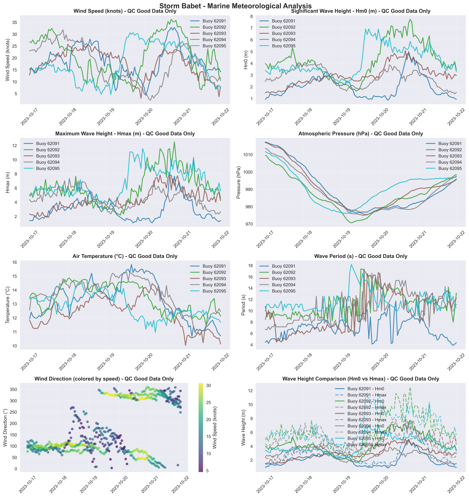

# Storm Babet - Marine Storm Report

**Report Generated:** 2025-10-02 14:38:37

## Marine Observations Summary

### Data Sources
- **Buoy 62091** (M2 Buoy): 53.47°N, 5.42°W
- **Buoy 62092** (M3 Buoy): 53.48°N, 5.42°W
- **Buoy 62093** (M4 Buoy): 51.22°N, 6.70°W
- **Buoy 62094** (M5 Buoy): 51.69°N, 6.70°W
- **Buoy 62095** (M6 Buoy): 53.06°N, 7.90°W

### Peak Conditions Observed

| Buoy (Location) | Sustained Wind Speeds | Gust Wind Speeds | Significant Wave Height | Individual Wave | MSLP (hPa) |
|---|---|---|---|---|---|
| M2 Buoy | **61 km/h** (33 knots or 17 mph) Fri 20 Oct 2023 17 UTC | **80 km/h** (43 knots or 22 mph) Fri 20 Oct 2023 17 UTC | **4.8 m** Fri 20 Oct 2023 18 UTC | **7.8 m** Fri 20 Oct 2023 16 UTC | **976.3** Thu 19 Oct 2023 09 UTC |
| M3 Buoy | **67 km/h** (36 knots or 19 mph) Fri 20 Oct 2023 17 UTC | **86 km/h** (47 knots or 24 mph) Fri 20 Oct 2023 17 UTC | **7.7 m** Fri 20 Oct 2023 19 UTC | **12.5 m** Fri 20 Oct 2023 19 UTC | **970.6** Thu 19 Oct 2023 06 UTC |
| M4 Buoy | **48 km/h** (26 knots or 13 mph) Wed 18 Oct 2023 00 UTC | **66 km/h** (36 knots or 18 mph) Fri 20 Oct 2023 13 UTC | **5.1 m** Fri 20 Oct 2023 16 UTC | **8.2 m** Fri 20 Oct 2023 16 UTC | **975.3** Thu 19 Oct 2023 15 UTC |
| M5 Buoy | **59 km/h** (32 knots or 16 mph) Tue 17 Oct 2023 21 UTC | **77 km/h** (42 knots or 21 mph) Tue 17 Oct 2023 23 UTC | **4.0 m** Tue 17 Oct 2023 20 UTC | **7.3 m** Wed 18 Oct 2023 01 UTC | **974.9** Thu 19 Oct 2023 13 UTC |
| M6 Buoy | **57 km/h** (31 knots or 16 mph) Thu 19 Oct 2023 17 UTC | **82 km/h** (44 knots or 23 mph) Thu 19 Oct 2023 17 UTC | **6.9 m** Thu 19 Oct 2023 15 UTC | **11.6 m** Thu 19 Oct 2023 23 UTC | **976.0** Thu 19 Oct 2023 03 UTC |

### Station-by-Station Analysis

### Buoy 62091 - M2 Buoy
- **Location:** 53.47°N, 5.42°W
- **Peak Wind Speed:** 32.8 knots (60.8 km/h) on Fri 20 Oct 2023 17:00 UTC
- **Peak Significant Wave Height (Hm0):** 4.8 m on Fri 20 Oct 2023 18:00 UTC
- **Peak Maximum Wave Height (Hmax):** 7.8 m on Fri 20 Oct 2023 16:00 UTC
- **Minimum Pressure:** 976.3 hPa on Thu 19 Oct 2023 09:00 UTC
- **Data Quality:** Excellent (100.0% good data)
- **Observations:** 121 records (QC good data only)

### Buoy 62092 - M3 Buoy
- **Location:** 53.48°N, 5.42°W
- **Peak Wind Speed:** 36.2 knots (67.1 km/h) on Fri 20 Oct 2023 17:00 UTC
- **Peak Significant Wave Height (Hm0):** 7.7 m on Fri 20 Oct 2023 19:00 UTC
- **Peak Maximum Wave Height (Hmax):** 12.5 m on Fri 20 Oct 2023 19:00 UTC
- **Minimum Pressure:** 970.6 hPa on Thu 19 Oct 2023 06:00 UTC
- **Data Quality:** Excellent (100.0% good data)
- **Observations:** 121 records (QC good data only)

### Buoy 62093 - M4 Buoy
- **Location:** 51.22°N, 6.70°W
- **Peak Wind Speed:** 25.7 knots (47.7 km/h) on Wed 18 Oct 2023 00:00 UTC
- **Peak Significant Wave Height (Hm0):** 5.1 m on Fri 20 Oct 2023 16:00 UTC
- **Peak Maximum Wave Height (Hmax):** 8.2 m on Fri 20 Oct 2023 16:00 UTC
- **Minimum Pressure:** 975.3 hPa on Thu 19 Oct 2023 15:00 UTC
- **Data Quality:** Excellent (100.0% good data)
- **Observations:** 121 records (QC good data only)

### Buoy 62094 - M5 Buoy
- **Location:** 51.69°N, 6.70°W
- **Peak Wind Speed:** 31.8 knots (58.9 km/h) on Tue 17 Oct 2023 21:00 UTC
- **Peak Significant Wave Height (Hm0):** 4.0 m on Tue 17 Oct 2023 20:00 UTC
- **Peak Maximum Wave Height (Hmax):** 7.3 m on Wed 18 Oct 2023 01:00 UTC
- **Minimum Pressure:** 974.9 hPa on Thu 19 Oct 2023 13:00 UTC
- **Data Quality:** Excellent (100.0% good data)
- **Observations:** 121 records (QC good data only)

### Buoy 62095 - M6 Buoy
- **Location:** 53.06°N, 7.90°W
- **Peak Wind Speed:** 30.6 knots (56.7 km/h) on Thu 19 Oct 2023 17:00 UTC
- **Peak Significant Wave Height (Hm0):** 6.9 m on Thu 19 Oct 2023 15:00 UTC
- **Peak Maximum Wave Height (Hmax):** 11.6 m on Thu 19 Oct 2023 23:00 UTC
- **Minimum Pressure:** 976.0 hPa on Thu 19 Oct 2023 03:00 UTC
- **Data Quality:** Excellent (100.0% good data)
- **Observations:** 121 records (QC good data only)

## Meteorological Analysis

### Wind Analysis

The storm produced maximum sustained winds of **36.2 knots** (67.1 km/h).

**Wind Categories:**
- Force 7 — Near gale: 28–33 kn (50–61 km/h)
- Force 8 — Gale: 34–40 kn (62–74 km/h)
- Force 9 — Severe gale (aka Strong gale): 41–47 kn (75–88 km/h)
- Force 10 — Storm: 48–55 kn (89–102 km/h)
- Force 11 — Violent storm: 56–63 kn (103–117 km/h)
- Force 12 — Hurricane force: ≥64 kn (≥118 km/h)

### Wave Analysis  

**Significant Wave Heights (Hm0):** Peak values reached **7.7 m**, representing **high**.

**Maximum Wave Heights (Hmax):** Individual wave heights peaked at **12.5 m**. Note: Hmax values represent individual wave heights and are not used for sea state classification.

**Wave Height Relationship:** The Hmax/Hm0 ratio was **1.62**, within normal range (1.3-1.8).

**Sea State Classification (Hm0):**
- Rough: 2.5-4.0 m
- Very Rough: 4.0-6.0 m
- High: 6.0-9.0 m
- Very High: 9.0-14.0 m
- Phenomenal: >14.0 m

**Wave Height Definitions:**
- **Hm0 (Significant Wave Height):** Average height of the highest one-third of waves
- **Hmax (Maximum Wave Height):** Highest individual wave recorded during the period

## Quality Control Summary

**Total Records:** 605

**QC Status Distribution:**
- Good Data (QC=1): 605 records (100.0%)
- Adjusted Data (QC=5): 0 records (0.0%)
- Missing Data (QC=9): 0 records (0.0%)
- No QC (QC=0): 0 records (0.0%)

## Data Sources and Logger Information

### Active Logger Information During Storm Period

**Buoy 62091 (M2 Buoy):**
- Logger(s) used: 347_Wavesense  , 8704_CR6       

**Buoy 62092 (M3 Buoy):**
- Logger(s) used: 314_Wavesense  , 12146_CR6      

**Buoy 62093 (M4 Buoy):**
- Logger(s) used: 189_Wavesense  , 12144_CR6      

**Buoy 62094 (M5 Buoy):**
- Logger(s) used: 12142_CR6      , 12143_CR6      

**Buoy 62095 (M6 Buoy):**
- Logger(s) used: 12145_CR6      , 341_Wavesense  

**Note:** This report uses only quality-controlled data (QC indicators 1 and 5) for meteorological analysis. Logger information shows which data acquisition systems were active during the storm period.

## Data Visualization

*Figure 1: Marine meteorological analysis showing wind speed, wave height, atmospheric pressure, air temperature, wind direction, and wave period during Storm Babet.*

## Technical Notes

### QC Methods Applied
- **Manual QC:** Visual inspection and expert validation
- **Automatic QC:** Range checks, spike detection, and flat-line identification

### Data Quality Indicators
- 0: No QC performed
- 1: QC performed, data OK
- 4: QC performed, raw data not OK and not adjusted
- 5: QC performed, raw data not OK but value adjusted/interpolated
- 6: QC performed, data OK (Datawell Hmax sensor specific)
- 9: Data missing

---

*Report generated by Marine Storm Analysis System*
*Data source: Irish Marine Data Buoy Network*
*Quality controlled data from Met Éireann marine observations*
