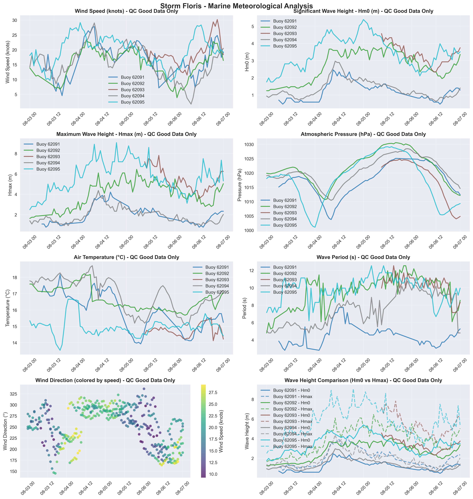

# Storm Floris - Marine Storm Report

**Report Generated:** 2025-10-02 14:39:24

## Marine Observations Summary

### Data Sources
- **Buoy 62091** (M2 Buoy): 53.47°N, 5.42°W
- **Buoy 62092** (M3 Buoy): 53.48°N, 5.42°W
- **Buoy 62093** (M4 Buoy): 51.22°N, 6.70°W
- **Buoy 62094** (M5 Buoy): 51.69°N, 6.70°W
- **Buoy 62095** (M6 Buoy): 53.06°N, 7.90°W

### Peak Conditions Observed

| Buoy (Location) | Sustained Wind Speeds | Gust Wind Speeds | Significant Wave Height | Individual Wave | MSLP (hPa) |
|---|---|---|---|---|---|
| M2 Buoy | **51 km/h** (28 knots or 14 mph) Mon 04 Aug 2025 08 UTC | **67 km/h** (36 knots or 19 mph) Mon 04 Aug 2025 08 UTC | **2.5 m** Mon 04 Aug 2025 09 UTC | **4.2 m** Mon 04 Aug 2025 16 UTC | **1003.7** Mon 04 Aug 2025 08 UTC |
| M3 Buoy | **43 km/h** (23 knots or 12 mph) Mon 04 Aug 2025 04 UTC | **66 km/h** (35 knots or 18 mph) Mon 04 Aug 2025 05 UTC | **4.1 m** Tue 05 Aug 2025 14 UTC | **6.4 m** Tue 05 Aug 2025 05 UTC | **1010.7** Mon 04 Aug 2025 05 UTC |
| M4 Buoy | **56 km/h** (30 knots or 16 mph) Wed 06 Aug 2025 21 UTC | **73 km/h** (39 knots or 20 mph) Wed 06 Aug 2025 19 UTC | **4.6 m** Tue 05 Aug 2025 09 UTC | **7.8 m** Tue 05 Aug 2025 16 UTC | **1004.0** Wed 06 Aug 2025 22 UTC |
| M5 Buoy | **54 km/h** (29 knots or 15 mph) Mon 04 Aug 2025 08 UTC | **70 km/h** (38 knots or 20 mph) Mon 04 Aug 2025 08 UTC | **3.0 m** Mon 04 Aug 2025 10 UTC | **4.4 m** Mon 04 Aug 2025 10 UTC | **1010.4** Mon 04 Aug 2025 08 UTC |
| M6 Buoy | **54 km/h** (29 knots or 15 mph) Mon 04 Aug 2025 01 UTC | **79 km/h** (43 knots or 22 mph) Wed 06 Aug 2025 12 UTC | **5.4 m** Tue 05 Aug 2025 00 UTC | **9.1 m** Mon 04 Aug 2025 19 UTC | **1001.1** Mon 04 Aug 2025 00 UTC |

### Station-by-Station Analysis

### Buoy 62091 - M2 Buoy
- **Location:** 53.47°N, 5.42°W
- **Peak Wind Speed:** 27.8 knots (51.5 km/h) on Mon 04 Aug 2025 08:00 UTC
- **Peak Significant Wave Height (Hm0):** 2.5 m on Mon 04 Aug 2025 09:00 UTC
- **Peak Maximum Wave Height (Hmax):** 4.2 m on Mon 04 Aug 2025 16:00 UTC
- **Minimum Pressure:** 1003.7 hPa on Mon 04 Aug 2025 08:00 UTC
- **Data Quality:** Excellent (100.0% good data)
- **Observations:** 70 records (QC good data only)

### Buoy 62092 - M3 Buoy
- **Location:** 53.48°N, 5.42°W
- **Peak Wind Speed:** 23.3 knots (43.2 km/h) on Mon 04 Aug 2025 04:00 UTC
- **Peak Significant Wave Height (Hm0):** 4.1 m on Tue 05 Aug 2025 14:00 UTC
- **Peak Maximum Wave Height (Hmax):** 6.4 m on Tue 05 Aug 2025 05:00 UTC
- **Minimum Pressure:** 1010.7 hPa on Mon 04 Aug 2025 05:00 UTC
- **Data Quality:** Excellent (100.0% good data)
- **Observations:** 92 records (QC good data only)

### Buoy 62093 - M4 Buoy
- **Location:** 51.22°N, 6.70°W
- **Peak Wind Speed:** 30.2 knots (55.9 km/h) on Wed 06 Aug 2025 21:00 UTC
- **Peak Significant Wave Height (Hm0):** 4.6 m on Tue 05 Aug 2025 09:00 UTC
- **Peak Maximum Wave Height (Hmax):** 7.8 m on Tue 05 Aug 2025 16:00 UTC
- **Minimum Pressure:** 1004.0 hPa on Wed 06 Aug 2025 22:00 UTC
- **Data Quality:** Excellent (100.0% good data)
- **Observations:** 40 records (QC good data only)

### Buoy 62094 - M5 Buoy
- **Location:** 51.69°N, 6.70°W
- **Peak Wind Speed:** 29.0 knots (53.8 km/h) on Mon 04 Aug 2025 08:00 UTC
- **Peak Significant Wave Height (Hm0):** 3.0 m on Mon 04 Aug 2025 10:00 UTC
- **Peak Maximum Wave Height (Hmax):** 4.4 m on Mon 04 Aug 2025 10:00 UTC
- **Minimum Pressure:** 1010.4 hPa on Mon 04 Aug 2025 08:00 UTC
- **Data Quality:** Excellent (100.0% good data)
- **Observations:** 92 records (QC good data only)

### Buoy 62095 - M6 Buoy
- **Location:** 53.06°N, 7.90°W
- **Peak Wind Speed:** 29.2 knots (54.0 km/h) on Mon 04 Aug 2025 01:00 UTC
- **Peak Significant Wave Height (Hm0):** 5.4 m on Tue 05 Aug 2025 00:00 UTC
- **Peak Maximum Wave Height (Hmax):** 9.1 m on Mon 04 Aug 2025 19:00 UTC
- **Minimum Pressure:** 1001.1 hPa on Mon 04 Aug 2025 00:00 UTC
- **Data Quality:** Excellent (100.0% good data)
- **Observations:** 97 records (QC good data only)

## Meteorological Analysis

### Wind Analysis

The storm produced maximum sustained winds of **30.2 knots** (55.9 km/h).

**Wind Categories:**
- Force 7 — Near gale: 28–33 kn (50–61 km/h)
- Force 8 — Gale: 34–40 kn (62–74 km/h)
- Force 9 — Severe gale (aka Strong gale): 41–47 kn (75–88 km/h)
- Force 10 — Storm: 48–55 kn (89–102 km/h)
- Force 11 — Violent storm: 56–63 kn (103–117 km/h)
- Force 12 — Hurricane force: ≥64 kn (≥118 km/h)

### Wave Analysis  

**Significant Wave Heights (Hm0):** Peak values reached **5.4 m**, representing **very rough**.

**Maximum Wave Heights (Hmax):** Individual wave heights peaked at **9.1 m**. Note: Hmax values represent individual wave heights and are not used for sea state classification.

**Wave Height Relationship:** The Hmax/Hm0 ratio was **1.68**, within normal range (1.3-1.8).

**Sea State Classification (Hm0):**
- Rough: 2.5-4.0 m
- Very Rough: 4.0-6.0 m
- High: 6.0-9.0 m
- Very High: 9.0-14.0 m
- Phenomenal: >14.0 m

**Wave Height Definitions:**
- **Hm0 (Significant Wave Height):** Average height of the highest one-third of waves
- **Hmax (Maximum Wave Height):** Highest individual wave recorded during the period

## Quality Control Summary

**Total Records:** 391

**QC Status Distribution:**
- Good Data (QC=1): 391 records (100.0%)
- Adjusted Data (QC=5): 0 records (0.0%)
- Missing Data (QC=9): 0 records (0.0%)
- No QC (QC=0): 0 records (0.0%)

## Data Sources and Logger Information

### Active Logger Information During Storm Period

**Buoy 62091 (M2 Buoy):**
- Logger(s) used: 22221_CR6      , 12145_CR6      

**Buoy 62092 (M3 Buoy):**
- Logger(s) used: 12147_CR6      , 427_Wavesense  

**Buoy 62093 (M4 Buoy):**
- Logger(s) used: 13443_CR6      , 12146_CR6      

**Buoy 62094 (M5 Buoy):**
- Logger(s) used: 8704_CR6       , 347_Wavesense  

**Buoy 62095 (M6 Buoy):**
- Logger(s) used: 12142_CR6      , 12143_CR6      

**Note:** This report uses only quality-controlled data (QC indicators 1 and 5) for meteorological analysis. Logger information shows which data acquisition systems were active during the storm period.

## Data Visualization

*Figure 1: Marine meteorological analysis showing wind speed, wave height, atmospheric pressure, air temperature, wind direction, and wave period during Storm Floris.*

## Technical Notes

### QC Methods Applied
- **Manual QC:** Visual inspection and expert validation
- **Automatic QC:** Range checks, spike detection, and flat-line identification

### Data Quality Indicators
- 0: No QC performed
- 1: QC performed, data OK
- 4: QC performed, raw data not OK and not adjusted
- 5: QC performed, raw data not OK but value adjusted/interpolated
- 6: QC performed, data OK (Datawell Hmax sensor specific)
- 9: Data missing

---

*Report generated by Marine Storm Analysis System*
*Data source: Irish Marine Data Buoy Network*
*Quality controlled data from Met Éireann marine observations*
