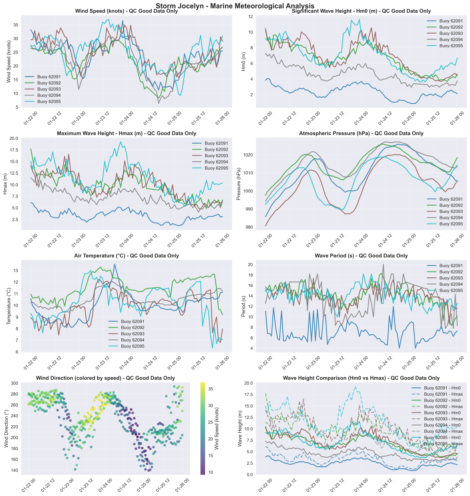

# Storm Jocelyn - Marine Storm Report

**Report Generated:** 2025-10-02 14:39:15

## Marine Observations Summary

### Data Sources
- **Buoy 62091** (M2 Buoy): 53.47°N, 5.42°W
- **Buoy 62092** (M3 Buoy): 53.48°N, 5.42°W
- **Buoy 62093** (M4 Buoy): 51.22°N, 6.70°W
- **Buoy 62094** (M5 Buoy): 51.69°N, 6.70°W
- **Buoy 62095** (M6 Buoy): 53.06°N, 7.90°W

### Peak Conditions Observed

| Buoy (Location) | Sustained Wind Speeds | Gust Wind Speeds | Significant Wave Height | Individual Wave | MSLP (hPa) |
|---|---|---|---|---|---|
| M2 Buoy | **67 km/h** (36 knots or 19 mph) Tue 23 Jan 2024 22 UTC | **92 km/h** (49 knots or 25 mph) Tue 23 Jan 2024 22 UTC | **4.1 m** Mon 22 Jan 2024 01 UTC | **6.1 m** Mon 22 Jan 2024 00 UTC | **985.6** Mon 22 Jan 2024 00 UTC |
| M3 Buoy | **54 km/h** (29 knots or 15 mph) Tue 23 Jan 2024 20 UTC | **88 km/h** (47 knots or 24 mph) Tue 23 Jan 2024 20 UTC | **10.5 m** Mon 22 Jan 2024 00 UTC | **17.7 m** Mon 22 Jan 2024 00 UTC | **997.6** Mon 22 Jan 2024 00 UTC |
| M4 Buoy | **65 km/h** (35 knots or 18 mph) Tue 23 Jan 2024 20 UTC | **101 km/h** (55 knots or 28 mph) Tue 23 Jan 2024 20 UTC | **10.5 m** Wed 24 Jan 2024 05 UTC | **16.5 m** Mon 22 Jan 2024 19 UTC | **980.6** Mon 22 Jan 2024 00 UTC |
| M5 Buoy | **58 km/h** (31 knots or 16 mph) Tue 23 Jan 2024 21 UTC | **80 km/h** (43 knots or 22 mph) Tue 23 Jan 2024 16 UTC | **7.3 m** Mon 22 Jan 2024 00 UTC | **12.5 m** Mon 22 Jan 2024 03 UTC | **994.2** Mon 22 Jan 2024 00 UTC |
| M6 Buoy | **68 km/h** (37 knots or 19 mph) Tue 23 Jan 2024 15 UTC | **107 km/h** (58 knots or 30 mph) Tue 23 Jan 2024 13 UTC | **11.6 m** Tue 23 Jan 2024 23 UTC | **19.2 m** Tue 23 Jan 2024 21 UTC | **989.7** Tue 23 Jan 2024 15 UTC |

### Station-by-Station Analysis

### Buoy 62091 - M2 Buoy
- **Location:** 53.47°N, 5.42°W
- **Peak Wind Speed:** 36.4 knots (67.5 km/h) on Tue 23 Jan 2024 22:00 UTC
- **Peak Significant Wave Height (Hm0):** 4.1 m on Mon 22 Jan 2024 01:00 UTC
- **Peak Maximum Wave Height (Hmax):** 6.1 m on Mon 22 Jan 2024 00:00 UTC
- **Minimum Pressure:** 985.6 hPa on Mon 22 Jan 2024 00:00 UTC
- **Data Quality:** Excellent (100.0% good data)
- **Observations:** 97 records (QC good data only)

### Buoy 62092 - M3 Buoy
- **Location:** 53.48°N, 5.42°W
- **Peak Wind Speed:** 29.4 knots (54.4 km/h) on Tue 23 Jan 2024 20:00 UTC
- **Peak Significant Wave Height (Hm0):** 10.5 m on Mon 22 Jan 2024 00:00 UTC
- **Peak Maximum Wave Height (Hmax):** 17.7 m on Mon 22 Jan 2024 00:00 UTC
- **Minimum Pressure:** 997.6 hPa on Mon 22 Jan 2024 00:00 UTC
- **Data Quality:** Excellent (100.0% good data)
- **Observations:** 90 records (QC good data only)

### Buoy 62093 - M4 Buoy
- **Location:** 51.22°N, 6.70°W
- **Peak Wind Speed:** 35.1 knots (65.0 km/h) on Tue 23 Jan 2024 20:00 UTC
- **Peak Significant Wave Height (Hm0):** 10.5 m on Wed 24 Jan 2024 05:00 UTC
- **Peak Maximum Wave Height (Hmax):** 16.5 m on Mon 22 Jan 2024 19:00 UTC
- **Minimum Pressure:** 980.6 hPa on Mon 22 Jan 2024 00:00 UTC
- **Data Quality:** Excellent (100.0% good data)
- **Observations:** 97 records (QC good data only)

### Buoy 62094 - M5 Buoy
- **Location:** 51.69°N, 6.70°W
- **Peak Wind Speed:** 31.1 knots (57.6 km/h) on Tue 23 Jan 2024 21:00 UTC
- **Peak Significant Wave Height (Hm0):** 7.3 m on Mon 22 Jan 2024 00:00 UTC
- **Peak Maximum Wave Height (Hmax):** 12.5 m on Mon 22 Jan 2024 03:00 UTC
- **Minimum Pressure:** 994.2 hPa on Mon 22 Jan 2024 00:00 UTC
- **Data Quality:** Excellent (100.0% good data)
- **Observations:** 92 records (QC good data only)

### Buoy 62095 - M6 Buoy
- **Location:** 53.06°N, 7.90°W
- **Peak Wind Speed:** 36.9 knots (68.3 km/h) on Tue 23 Jan 2024 15:00 UTC
- **Peak Significant Wave Height (Hm0):** 11.6 m on Tue 23 Jan 2024 23:00 UTC
- **Peak Maximum Wave Height (Hmax):** 19.2 m on Tue 23 Jan 2024 21:00 UTC
- **Minimum Pressure:** 989.7 hPa on Tue 23 Jan 2024 15:00 UTC
- **Data Quality:** Excellent (100.0% good data)
- **Observations:** 97 records (QC good data only)

## Meteorological Analysis

### Wind Analysis

The storm produced maximum sustained winds of **36.9 knots** (68.3 km/h).

**Wind Categories:**
- Force 7 — Near gale: 28–33 kn (50–61 km/h)
- Force 8 — Gale: 34–40 kn (62–74 km/h)
- Force 9 — Severe gale (aka Strong gale): 41–47 kn (75–88 km/h)
- Force 10 — Storm: 48–55 kn (89–102 km/h)
- Force 11 — Violent storm: 56–63 kn (103–117 km/h)
- Force 12 — Hurricane force: ≥64 kn (≥118 km/h)

### Wave Analysis  

**Significant Wave Heights (Hm0):** Peak values reached **11.6 m**, representing **very high**.

**Maximum Wave Heights (Hmax):** Individual wave heights peaked at **19.2 m**. Note: Hmax values represent individual wave heights and are not used for sea state classification.

**Wave Height Relationship:** The Hmax/Hm0 ratio was **1.66**, within normal range (1.3-1.8).

**Sea State Classification (Hm0):**
- Rough: 2.5-4.0 m
- Very Rough: 4.0-6.0 m
- High: 6.0-9.0 m
- Very High: 9.0-14.0 m
- Phenomenal: >14.0 m

**Wave Height Definitions:**
- **Hm0 (Significant Wave Height):** Average height of the highest one-third of waves
- **Hmax (Maximum Wave Height):** Highest individual wave recorded during the period

## Quality Control Summary

**Total Records:** 473

**QC Status Distribution:**
- Good Data (QC=1): 473 records (100.0%)
- Adjusted Data (QC=5): 0 records (0.0%)
- Missing Data (QC=9): 0 records (0.0%)
- No QC (QC=0): 0 records (0.0%)

## Data Sources and Logger Information

### Active Logger Information During Storm Period

**Buoy 62091 (M2 Buoy):**
- Logger(s) used: 347_Wavesense  , 8704_CR6       

**Buoy 62092 (M3 Buoy):**
- Logger(s) used: 12147_CR6      , 427_Wavesense  

**Buoy 62093 (M4 Buoy):**
- Logger(s) used: 189_Wavesense  , 12144_CR6      

**Buoy 62094 (M5 Buoy):**
- Logger(s) used: 12142_CR6      , 12143_CR6      

**Buoy 62095 (M6 Buoy):**
- Logger(s) used: 12145_CR6      , 341_Wavesense  

**Note:** This report uses only quality-controlled data (QC indicators 1 and 5) for meteorological analysis. Logger information shows which data acquisition systems were active during the storm period.

## Data Visualization

*Figure 1: Marine meteorological analysis showing wind speed, wave height, atmospheric pressure, air temperature, wind direction, and wave period during Storm Jocelyn.*

## Technical Notes

### QC Methods Applied
- **Manual QC:** Visual inspection and expert validation
- **Automatic QC:** Range checks, spike detection, and flat-line identification

### Data Quality Indicators
- 0: No QC performed
- 1: QC performed, data OK
- 4: QC performed, raw data not OK and not adjusted
- 5: QC performed, raw data not OK but value adjusted/interpolated
- 6: QC performed, data OK (Datawell Hmax sensor specific)
- 9: Data missing

---

*Report generated by Marine Storm Analysis System*
*Data source: Irish Marine Data Buoy Network*
*Quality controlled data from Met Éireann marine observations*
