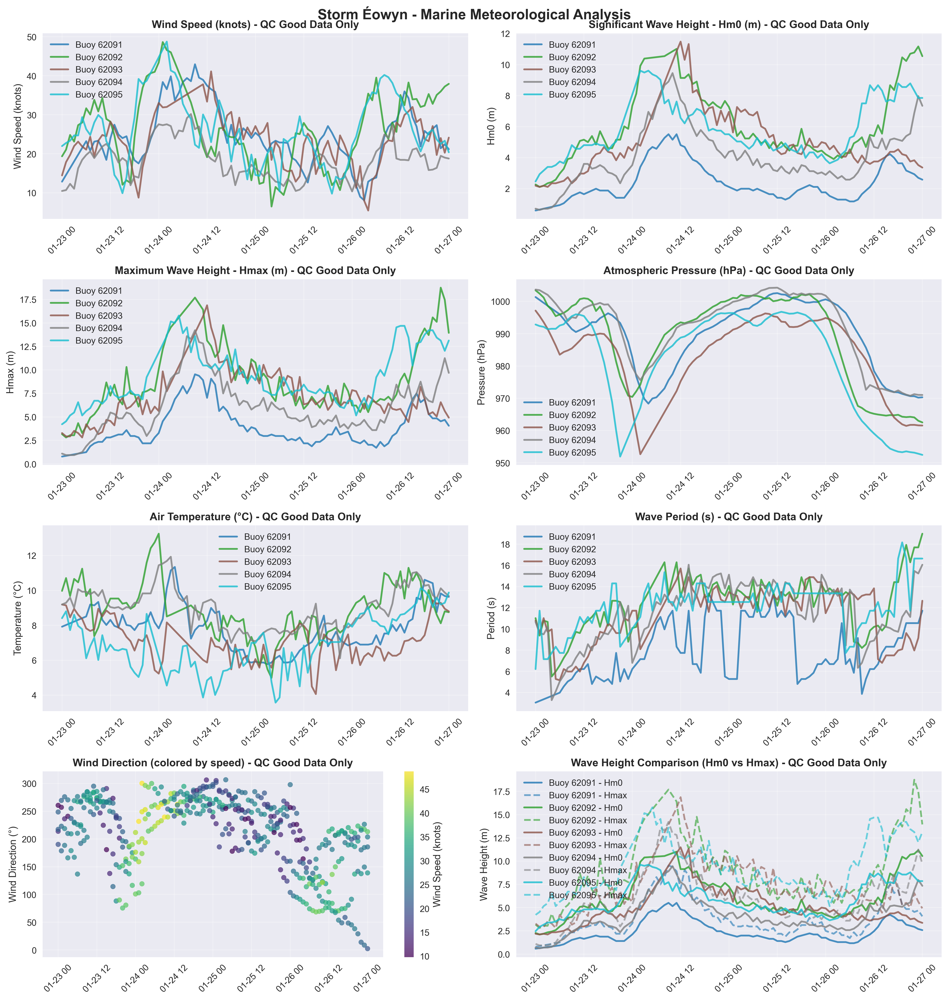

# Storm Éowyn - Marine Storm Report

**Report Generated:** 2025-10-02 14:39:19

## Marine Observations Summary

### Data Sources
- **Buoy 62091** (M2 Buoy): 53.47°N, 5.42°W
- **Buoy 62092** (M3 Buoy): 53.48°N, 5.42°W
- **Buoy 62093** (M4 Buoy): 51.22°N, 6.70°W
- **Buoy 62094** (M5 Buoy): 51.69°N, 6.70°W
- **Buoy 62095** (M6 Buoy): 53.06°N, 7.90°W

### Peak Conditions Observed

| Buoy (Location) | Sustained Wind Speeds | Gust Wind Speeds | Significant Wave Height | Individual Wave | MSLP (hPa) |
|---|---|---|---|---|---|
| M2 Buoy | **80 km/h** (43 knots or 22 mph) Fri 24 Jan 2025 09 UTC | **106 km/h** (57 knots or 29 mph) Fri 24 Jan 2025 09 UTC | **5.5 m** Fri 24 Jan 2025 09 UTC | **9.5 m** Fri 24 Jan 2025 09 UTC | **968.3** Fri 24 Jan 2025 04 UTC |
| M3 Buoy | **90 km/h** (49 knots or 25 mph) Fri 24 Jan 2025 01 UTC | **98 km/h** (53 knots or 27 mph) Thu 23 Jan 2025 21 UTC | **11.2 m** Sun 26 Jan 2025 23 UTC | **18.8 m** Sun 26 Jan 2025 22 UTC | **962.5** Mon 27 Jan 2025 00 UTC |
| M4 Buoy | **76 km/h** (41 knots or 21 mph) Fri 24 Jan 2025 13 UTC | **103 km/h** (56 knots or 29 mph) Fri 24 Jan 2025 13 UTC | **11.5 m** Fri 24 Jan 2025 12 UTC | **16.9 m** Fri 24 Jan 2025 12 UTC | **952.7** Fri 24 Jan 2025 02 UTC |
| M5 Buoy | **56 km/h** (30 knots or 16 mph) Fri 24 Jan 2025 08 UTC | **98 km/h** (53 knots or 27 mph) Fri 24 Jan 2025 07 UTC | **9.5 m** Fri 24 Jan 2025 10 UTC | **14.2 m** Fri 24 Jan 2025 09 UTC | **970.8** Sun 26 Jan 2025 21 UTC |
| M6 Buoy | **90 km/h** (49 knots or 25 mph) Fri 24 Jan 2025 02 UTC | **109 km/h** (59 knots or 30 mph) Fri 24 Jan 2025 03 UTC | **9.6 m** Fri 24 Jan 2025 02 UTC | **15.8 m** Fri 24 Jan 2025 05 UTC | **952.0** Thu 23 Jan 2025 21 UTC |

### Station-by-Station Analysis

### Buoy 62091 - M2 Buoy
- **Location:** 53.47°N, 5.42°W
- **Peak Wind Speed:** 42.9 knots (79.5 km/h) on Fri 24 Jan 2025 09:00 UTC
- **Peak Significant Wave Height (Hm0):** 5.5 m on Fri 24 Jan 2025 09:00 UTC
- **Peak Maximum Wave Height (Hmax):** 9.5 m on Fri 24 Jan 2025 09:00 UTC
- **Minimum Pressure:** 968.3 hPa on Fri 24 Jan 2025 04:00 UTC
- **Data Quality:** Excellent (100.0% good data)
- **Observations:** 92 records (QC good data only)

### Buoy 62092 - M3 Buoy
- **Location:** 53.48°N, 5.42°W
- **Peak Wind Speed:** 48.6 knots (90.1 km/h) on Fri 24 Jan 2025 01:00 UTC
- **Peak Significant Wave Height (Hm0):** 11.2 m on Sun 26 Jan 2025 23:00 UTC
- **Peak Maximum Wave Height (Hmax):** 18.8 m on Sun 26 Jan 2025 22:00 UTC
- **Minimum Pressure:** 962.5 hPa on Mon 27 Jan 2025 00:00 UTC
- **Data Quality:** Excellent (100.0% good data)
- **Observations:** 92 records (QC good data only)

### Buoy 62093 - M4 Buoy
- **Location:** 51.22°N, 6.70°W
- **Peak Wind Speed:** 41.1 knots (76.1 km/h) on Fri 24 Jan 2025 13:00 UTC
- **Peak Significant Wave Height (Hm0):** 11.5 m on Fri 24 Jan 2025 12:00 UTC
- **Peak Maximum Wave Height (Hmax):** 16.9 m on Fri 24 Jan 2025 12:00 UTC
- **Minimum Pressure:** 952.7 hPa on Fri 24 Jan 2025 02:00 UTC
- **Data Quality:** Excellent (100.0% good data)
- **Observations:** 89 records (QC good data only)

### Buoy 62094 - M5 Buoy
- **Location:** 51.69°N, 6.70°W
- **Peak Wind Speed:** 30.2 knots (55.9 km/h) on Fri 24 Jan 2025 08:00 UTC
- **Peak Significant Wave Height (Hm0):** 9.5 m on Fri 24 Jan 2025 10:00 UTC
- **Peak Maximum Wave Height (Hmax):** 14.2 m on Fri 24 Jan 2025 09:00 UTC
- **Minimum Pressure:** 970.8 hPa on Sun 26 Jan 2025 21:00 UTC
- **Data Quality:** Excellent (100.0% good data)
- **Observations:** 97 records (QC good data only)

### Buoy 62095 - M6 Buoy
- **Location:** 53.06°N, 7.90°W
- **Peak Wind Speed:** 48.7 knots (90.3 km/h) on Fri 24 Jan 2025 02:00 UTC
- **Peak Significant Wave Height (Hm0):** 9.6 m on Fri 24 Jan 2025 02:00 UTC
- **Peak Maximum Wave Height (Hmax):** 15.8 m on Fri 24 Jan 2025 05:00 UTC
- **Minimum Pressure:** 952.0 hPa on Thu 23 Jan 2025 21:00 UTC
- **Data Quality:** Excellent (100.0% good data)
- **Observations:** 93 records (QC good data only)

## Meteorological Analysis

### Wind Analysis

The storm produced maximum sustained winds of **48.7 knots** (90.3 km/h).

**Wind Categories:**
- Force 7 — Near gale: 28–33 kn (50–61 km/h)
- Force 8 — Gale: 34–40 kn (62–74 km/h)
- Force 9 — Severe gale (aka Strong gale): 41–47 kn (75–88 km/h)
- Force 10 — Storm: 48–55 kn (89–102 km/h)
- Force 11 — Violent storm: 56–63 kn (103–117 km/h)
- Force 12 — Hurricane force: ≥64 kn (≥118 km/h)

### Wave Analysis  

**Significant Wave Heights (Hm0):** Peak values reached **11.5 m**, representing **very high**.

**Maximum Wave Heights (Hmax):** Individual wave heights peaked at **18.8 m**. Note: Hmax values represent individual wave heights and are not used for sea state classification.

**Wave Height Relationship:** The Hmax/Hm0 ratio was **1.63**, within normal range (1.3-1.8).

**Sea State Classification (Hm0):**
- Rough: 2.5-4.0 m
- Very Rough: 4.0-6.0 m
- High: 6.0-9.0 m
- Very High: 9.0-14.0 m
- Phenomenal: >14.0 m

**Wave Height Definitions:**
- **Hm0 (Significant Wave Height):** Average height of the highest one-third of waves
- **Hmax (Maximum Wave Height):** Highest individual wave recorded during the period

### Pressure Analysis

Atmospheric pressure dropped to a minimum of **952.0 hPa**.

## Quality Control Summary

**Total Records:** 463

**QC Status Distribution:**
- Good Data (QC=1): 463 records (100.0%)
- Adjusted Data (QC=5): 0 records (0.0%)
- Missing Data (QC=9): 0 records (0.0%)
- No QC (QC=0): 0 records (0.0%)

## Data Sources and Logger Information

### Active Logger Information During Storm Period

**Buoy 62091 (M2 Buoy):**
- Logger(s) used: 12105_CR6      , 7577_CR6       

**Buoy 62092 (M3 Buoy):**
- Logger(s) used: 12147_CR6      , 427_Wavesense  

**Buoy 62093 (M4 Buoy):**
- Logger(s) used: 189_Wavesense  , 12144_CR6      

**Buoy 62094 (M5 Buoy):**
- Logger(s) used: 8704_CR6       , 347_Wavesense  

**Buoy 62095 (M6 Buoy):**
- Logger(s) used: 12146_CR6      , 13443_CR6      

**Note:** This report uses only quality-controlled data (QC indicators 1 and 5) for meteorological analysis. Logger information shows which data acquisition systems were active during the storm period.

## Data Visualization

*Figure 1: Comprehensive marine meteorological analysis showing wind speed, wave height, atmospheric pressure, air temperature, wind direction, and wave period during Storm Éowyn.*

## Technical Notes

### QC Methods Applied
- **Manual QC:** Visual inspection and expert validation
- **Automatic QC:** Range checks, spike detection, and flat-line identification

### Data Quality Indicators
- 0: No QC performed
- 1: QC performed, data OK
- 4: QC performed, raw data not OK and not adjusted
- 5: QC performed, raw data not OK but value adjusted/interpolated
- 6: QC performed, data OK (Datawell Hmax sensor specific)
- 9: Data missing

---

*Report generated by Marine Storm Analysis System*
*Data source: Irish Marine Data Buoy Network*
*Quality controlled data from Met Éireann marine observations*
